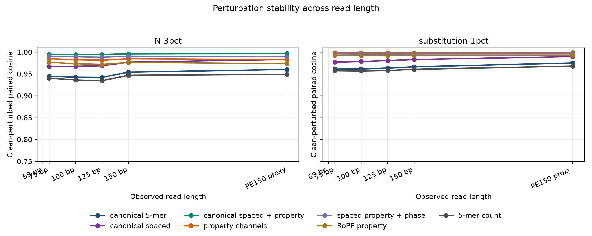
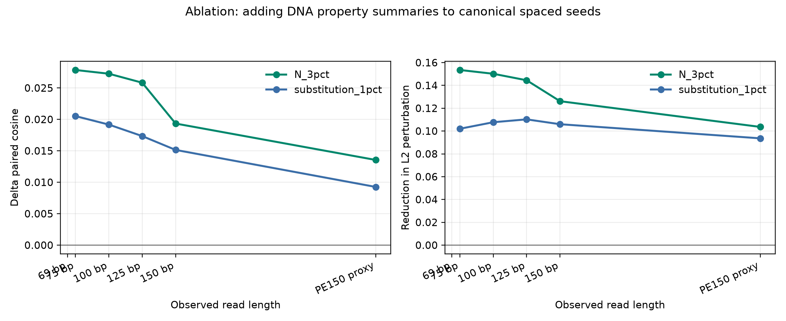
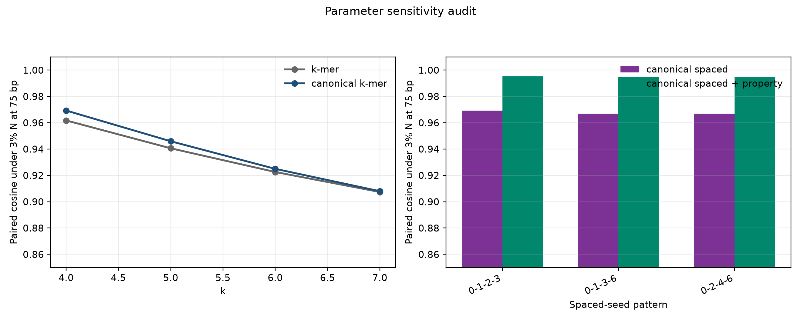
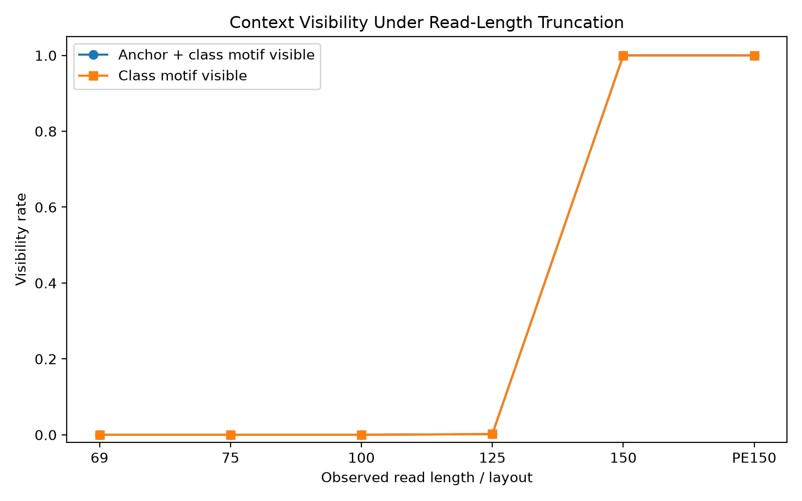
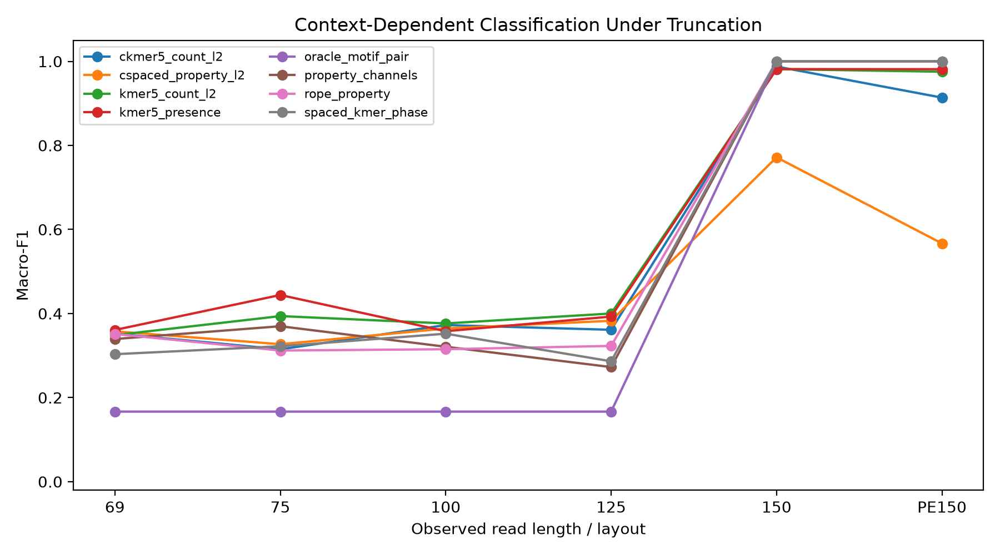
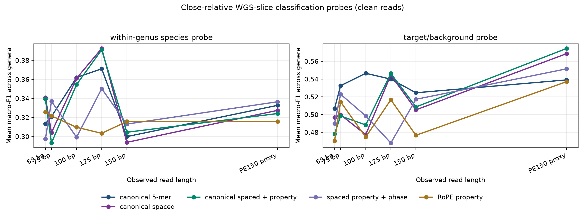

# Representation diagnostics for ultra-short DNA reads in mNGS-like settings

**A lightweight study of k-mer, canonical spaced-seed, property-aware and attention-compatible encodings**

Manuscript draft generated 2026-06-20.

## Abstract

Ultra-short sequencing reads are common after quality control in clinical metagenomic next-generation sequencing (mNGS), yet many representation choices for DNA reads are evaluated mainly by downstream classification accuracy. Here we frame read representation as an information-diagnostic problem: which encodings preserve strand symmetry, local composition, biochemical properties, perturbation stability, positional context and close-relative separability when reads are only 69-150 bp long? We compare contiguous k-mers, canonical k-mers, canonical spaced seeds, property-channel encodings, phase-aware encodings and RoPE-like property encodings on controlled reads and a lightweight close-relative WGS-slice panel from clinically relevant genera. The main proposed representation, canonical spaced-property encoding (`cspaced_property_l2` in code), concatenates reverse-complement canonical spaced-token counts with low-dimensional DNA property summaries. It is not a replacement for canonical k-mers. Instead, it acts as a compact, strand-friendly and perturbation-stable auxiliary representation. In close-relative WGS-slice perturbation audits, adding property summaries to canonical spaced counts improved clean-versus-perturbed cosine by up to 0.028 and reduced L2 perturbation by up to 0.154 at 75 bp under 3% N masking. By contrast, canonical k-mer and canonical spaced variants remained strong baselines in close-relative classification probes. A motif-pair diagnostic further showed that read-length effects can be nonlinear for attention-like models: below 150 bp, a class-defining contextual motif pair can be structurally absent, not merely diluted. The study therefore supports a restrained claim: biologically informed auxiliary encodings can expose robustness and context properties that are hidden by accuracy-only benchmarks, while full mNGS diagnostic claims require larger server-scale validation.

## Introduction

Clinical mNGS has changed pathogen detection because it can identify unexpected organisms without a fixed target panel (Wilson et al., 2014) (Wilson et al., 2019). However, the computational problem is not just classification. A clinical read can be short, host-contaminated, quality-trimmed, ambiguous at N positions, or derived from either strand. These constraints make the representation layer scientifically important: before a classifier can succeed, the encoding must decide what information remains visible.

Most mature metagenomic classifiers rely on k-mer or related exact-match signals. Kraken, Kraken 2, CLARK, Centrifuge and Kaiju demonstrate how powerful indexed word or translated-word matching can be at scale (Wood and Salzberg, 2014) (Wood et al., 2019) (Ounit et al., 2015) (Kim et al., 2016) (Menzel et al., 2016). Community benchmarks such as CAMI also show that metagenomic tool performance depends strongly on dataset construction, novelty, abundance and taxonomic difficulty (Sczyrba et al., 2017) (Meyer et al., 2022). This argues against using a small local experiment as a clinical leaderboard.

At the same time, DNA language models and self-attention models have made sequence representation a central question. DeepMicrobes, MetaTransformer, DNABERT, Nucleotide Transformer and HyenaDNA illustrate the move from simple word counts toward learned embeddings, self-attention and single-nucleotide or long-range modeling (Liang et al., 2020) (Wichmann et al., 2023) (Ji et al., 2021) (Dalla-Torre et al., 2025) (Nguyen et al., 2023). These models motivate a more precise question for short mNGS reads: which information should be injected before learning, and which information is absent regardless of model capacity?

## Related Work

k-mer counting is a foundational alignment-free representation, with efficient counting algorithms and wide use in comparison, classification and sketching (Marcais and Kingsford, 2011) (Ondov et al., 2016). Canonical k-mers are not a single named model but a common strand-symmetry operation: a word and its reverse complement are mapped to the same feature index. Spaced seeds, introduced for sensitive homology search and later adapted to metagenomic classification, provide a mismatch-tolerant alternative to contiguous words (Ma et al., 2002) (Brinda et al., 2015).

DNA can also be treated as a signal. Shannon's information theory gives language for capacity, uncertainty and information loss (Shannon, 1948), while genomic signal processing and numerical DNA mappings provide precedent for converting bases into biochemical or numeric channels (Voss, 1992) (Anastassiou, 2001) (Cristea, 2002). Our property encodings follow this tradition: they are deliberately small, interpretable channels rather than learned embeddings.

Transformer-style encodings add another issue: position and co-occurrence. Self-attention can connect all observed tokens (Vaswani et al., 2017), and rotary position embeddings provide a compact relative-position mechanism (Su et al., 2021). But attention cannot attend to a motif that has been trimmed away. This distinction motivates our context-visibility diagnostic.

## Problem Formulation

Let a DNA read be a sequence x = (x1, ..., xL), xi in {A,C,G,T,N}. A representation is a map phi(x) into either a fixed vector or a token sequence. The paper evaluates phi by information properties rather than by assuming one downstream classifier is definitive.

For a contiguous k-mer word w = x_i...x_{i+k-1}, the ordinary count vector stores c_w(x). The reverse-complement canonical form is canon(w) = min(w, rc(w)) under lexicographic order, so the canonical k-mer count feature is c_canon(w)(x). This operation is expected to improve strand consistency but may discard strand-specific information.

For a spaced seed pattern P = (p1, ..., pm), a spaced token is s_i,P(x) = x_{i+p1}...x_{i+pm}. A canonical spaced representation counts canon(s_i,P). The proposed canonical spaced-property representation concatenates this count vector with a compact property summary: mean and standard deviation of hydrogen-bond class, GC indicator, purine indicator and EIIP-like numeric value, plus N fraction, length scaling and sequence entropy. The final vector is L2-normalized. In code this method is named `cspaced_property_l2`; in the manuscript we call it canonical spaced-property encoding.

We evaluate five information properties: compactness, reverse-complement consistency, perturbation stability, read-length/context visibility and close-relative separability. Accuracy and macro-F1 are used only as tertiary probes: they test whether a simple readout can extract a signal from a representation, not whether the representation is clinically diagnostic.

## Experimental Design

The local panel contains 21 genomes from six clinically relevant genera: Acinetobacter, Burkholderia, Candida, Enterobacter, Escherichia and Klebsiella. Reads were sampled as 69, 75, 100, 125 and 150 bp single-end fragments plus a PE150 proxy represented by 300 bp concatenated end information. Perturbations included reverse complement, 3% N masking and 1% substitution. The panel is intentionally lightweight and close-relative-biased; it is a stress test, not a universal microbial benchmark.

We also used a controlled attention/context diagnostic. Latent templates contain a shared anchor motif near position 18 and a class-specific motif near position 138. Short reads can include the anchor while excluding the class motif. This design tests whether read shortening removes an entire semantic relation rather than only a proportional number of bases.

The metric hierarchy is fixed before interpreting results. Primary metrics are dimensionality, sparsity, paired cosine, perturbation L2 delta, component deltas and motif-pair visibility. Secondary metrics include close-relative stress probes. Tertiary metrics include accuracy and macro-F1 from nearest-centroid or lightweight linear readouts.

## Results

### Canonical spaced-property encoding has its clearest advantage in perturbation stability

The strongest supported advantage of canonical spaced-property encoding is robustness, especially under N masking. Adding property summaries to canonical spaced counts consistently increased clean-versus-perturbed cosine and reduced L2 change across 75-300 bp. The largest effect occurred at 75 bp under 3% N masking: cosine increased by 0.028 and mean L2 perturbation decreased by 0.154. The effect decreased with read length, which is plausible because longer reads provide more redundant word evidence.

| condition | length | delta_paired_cosine_mean | delta_paired_cosine_p05 | delta_l2_delta_mean | l2_improvement |
| --------- | ------ | ------------------------ | ----------------------- | ------------------- | -------------- |
| N_3pct    | 75     | 0.028                    | 0.041                   | -0.154              | 0.154          |
| N_3pct    | 100    | 0.027                    | 0.040                   | -0.150              | 0.150          |
| N_3pct    | 125    | 0.026                    | 0.038                   | -0.144              | 0.144          |
| N_3pct    | 150    | 0.019                    | 0.028                   | -0.126              | 0.126          |
| N_3pct    | 300    | 0.014                    | 0.019                   | -0.104              | 0.104          |

### Canonicalization, not property summaries alone, explains strand symmetry

Reverse-complement robustness was dominated by canonicalization. Canonical contiguous k-mers achieved paired cosine near 1.0 under reverse complement, whereas noncanonical contiguous k-mers had much lower paired cosine. The canonical spaced-property representation inherits this property from canonical spaced tokens. Therefore the manuscript should not attribute strand invariance to biochemical property summaries alone.

### k and spaced-seed pattern sensitivity argues against a single-parameter claim

A reviewer would reasonably ask why k=5 or why pattern (0,2,4,6) was selected. We therefore ran a lightweight sensitivity audit over k=4-7 and three spaced patterns. For N masking, canonical spaced-property variants remained the stability winners across all read lengths in the sampled audit, with paired cosine between 0.994 and 0.997. However, downstream close-relative probes were parameter-sensitive: the best readout settings changed with task and length. This is evidence for a representation-diagnostics paper, not a universal winner claim.

| condition | length | family                      | parameter       | paired_cosine_mean | paired_cosine_p05 | l2_delta_mean | observed_vocab_size |
| --------- | ------ | --------------------------- | --------------- | ------------------ | ----------------- | ------------- | ------------------- |
| N_3pct    | 69     | canonical spaced + property | pattern=0-1-2-3 | 0.994              | 0.993             | 0.105         | 147                 |
| N_3pct    | 75     | canonical spaced + property | pattern=0-1-2-3 | 0.995              | 0.993             | 0.098         | 147                 |
| N_3pct    | 100    | canonical spaced + property | pattern=0-1-2-3 | 0.995              | 0.994             | 0.100         | 147                 |
| N_3pct    | 125    | canonical spaced + property | pattern=0-1-2-3 | 0.995              | 0.993             | 0.100         | 147                 |
| N_3pct    | 150    | canonical spaced + property | pattern=0-1-2-3 | 0.996              | 0.996             | 0.084         | 147                 |
| N_3pct    | 300    | canonical spaced + property | pattern=0-1-2-3 | 0.997              | 0.997             | 0.074         | 147                 |

### Read length can erase context relations relevant to attention-like models

The attention/context diagnostic supports the user's core hypothesis: the loss caused by short reads is not always linear in base count. At 69, 75 and 100 bp the class-defining motif was absent, pair visibility was 0, and lightweight readouts stayed near chance. At 125 bp, accidental partial-prefix matches appeared but full pair visibility remained essentially absent. At 150 bp and PE150, the pair became fully visible and simple readouts reached perfect or near-perfect macro-F1. A Transformer with self-attention would have many token pairs even at 69 bp, but those pairs cannot include a missing class motif.

| length | observed_layout | pair_visible_rate | class_motif_visible_rate | representation    | macro_f1 |
| ------ | --------------- | ----------------- | ------------------------ | ----------------- | -------- |
| 69     | SE69            | 0.000             | 0.000                    | 5-mer presence    | 0.361    |
| 75     | SE75            | 0.000             | 0.000                    | 5-mer presence    | 0.444    |
| 100    | SE100           | 0.000             | 0.000                    | 5-mer count       | 0.376    |
| 125    | SE125           | 0.002             | 0.002                    | 5-mer count       | 0.400    |
| 150    | SE150           | 1.000             | 1.000                    | property channels | 1.000    |
| 300    | PE150           | 1.000             | 1.000                    | property channels | 1.000    |

### Close-relative classification is a stress probe, not the paper's main endpoint

The close-relative WGS-slice benchmark deliberately tests a harder situation than artificial composition tasks. It does not support a broad claim that the proposed method is better for species identification. Canonical k-mer and canonical spaced variants remained strong baselines. In the clean within-genus species probe, the best averaged readout in the core comparison was canonical spaced at 125 bp. In the target/background probe, canonical spaced-property was best at the PE150 proxy. In the k/pattern sensitivity audit, best settings varied by task: target/background at 75 bp favored canonical spaced pattern 0-1-3-6, while within-genus probes favored different k-mer or spaced settings depending on length.

| probe                | length | method           | parameter       | mean_macro_f1 | sd_macro_f1 | mean_accuracy | mean_features | genera |
| -------------------- | ------ | ---------------- | --------------- | ------------- | ----------- | ------------- | ------------- | ------ |
| target_background    | 75     | canonical spaced | pattern=0-1-3-6 | 0.547         | 0.158       | 0.633         | 136.000       | 5      |
| target_background    | 150    | canonical k-mer  | k=7             | 0.534         | 0.129       | 0.692         | 4111.000      | 5      |
| target_background    | 300    | k-mer            | k=5             | 0.539         | 0.097       | 0.658         | 1007.600      | 5      |
| within_genus_species | 75     | k-mer            | k=6             | 0.330         | 0.237       | 0.361         | 2109.500      | 6      |
| within_genus_species | 150    | canonical k-mer  | k=6             | 0.351         | 0.156       | 0.382         | 1779.833      | 6      |
| within_genus_species | 300    | canonical spaced | pattern=0-1-3-6 | 0.370         | 0.124       | 0.396         | 136.000       | 6      |

## Model Suitability

Different encodings suggest different model pairings. Canonical k-mer counts remain strong for nearest-centroid, linear and database-index-like methods because they expose exact local composition with strand symmetry. Canonical spaced counts are useful for compact, mismatch-tolerant linear or centroid readouts. Canonical spaced-property encoding is best used as an auxiliary dense feature block for QC-like robustness, perturbation-aware screening or concatenation with canonical k-mer features. Property channels and RoPE-property encodings are more natural for CNNs or attention models because they preserve per-position numeric channels. The present local study does not prove Transformer superiority; it defines when attention-compatible features have enough observed context to be meaningful.

## Discussion

The central conclusion is deliberately narrower than a classification claim. Ultra-short DNA read representations differ in what they make stable, compact and visible. Canonical k-mers remain strong close-relative baselines. Canonical spaced-property encoding contributes a different advantage: compact perturbation stability and interpretability. This division is scientifically useful because mNGS workflows face both taxonomic discrimination and robustness/QC problems.

The study also clarifies the role of accuracy. Accuracy and macro-F1 are helpful only when they are interpreted as readout probes. If written as clinical endpoints, the current experiments would be underpowered and non-representative. If written as representation diagnostics, they help map advantage regions and failure modes.

Several claims require server-scale follow-up. A larger panel should include many strains per close-relative complex, realistic FASTQ quality profiles, host/background mixtures, abundance variation and repeated random seeds. A tiny CNN/Transformer comparison should test whether property and RoPE-property channels help when the model can learn local or global interactions. Kraken2/Centrifuge/Kaiju audits would connect representation diagnostics to clinical-pipeline baselines, and an AMR-gene task would be needed before making resistance-detection claims.

## Methods

Genome metadata were selected from the local blood-panel spreadsheet and available WGS FASTA sources. Missing close-relative genomes were retrieved using NCBI Datasets when available. The reproducible scripts generate the close-relative manifest, sampled reads, perturbations, representation matrices, ablation metrics, sensitivity audits, figures and this manuscript. No heavy neural model was trained locally. Nearest-centroid and lightweight linear probes were used only to test signal readability.

Reverse-complement consistency was measured by paired cosine between a clean read and its reverse complement after representation. Perturbation stability was measured by paired cosine and L2 distance between clean and perturbed representations. Component ablation compared matched representations that differed by one prior: canonicalization, spaced seeding, property summary, phase or RoPE-like position handling.

Parameter sensitivity was run as a sampled audit. Stability used at most 120 paired reads per length/condition, k=4-7 and three spaced patterns. Classification sensitivity used 75, 150 and PE150 proxy lengths with at most 80 reads per genus. These limits make the audit reproducible on the local computer and should be expanded on a server for stronger statistical inference.

## Data and Code Availability

The code repository contains the read-generation scripts, representation builders, analysis workflows, result tables, figures and manuscript builder. Large downloaded reference genomes are not treated as manuscript evidence and should be regenerated from accession manifests when needed. The repository is intended to archive lightweight reproducibility artifacts while excluding environment folders and bulky downloaded FASTA files.

## Limitations

The experiments are lightweight and not clinically representative. The close-relative panel has 21 genomes from six genera, so it cannot represent the microbial tree or clinical sample complexity. The classification probes use simple readouts and are intentionally not clinical performance estimates. The attention diagnostic is synthetic; it demonstrates structural context loss but does not evaluate a full Transformer. The property channels are interpretable but may not capture all biologically relevant chemistry or evolutionary constraints.

## Conclusions

The safest conclusion is that no single DNA representation dominates all short-read mNGS-like settings. Canonical k-mer remains a strong close-relative classification backbone. Canonical spaced-property encoding is a compact, strand-friendly and perturbation-stable auxiliary representation with a clear advantage region in robustness diagnostics. Attention-compatible encodings should be evaluated with explicit context-visibility tests because short reads can delete whole motif relations. The resulting paper should be positioned as a representation-diagnostics study and a foundation for larger mNGS and AMR validation, not as a final clinical classifier.

## References

1. Wilson, Michael R.; Naccache, Samia N.; Samayoa, Erika; Biagtan, Mark; Bashir, Ali; Yu, Guixia; Salamat, S. M.; Somasekar, Sneha; Federman, Scot; Miller, Steve; Sokolic, Robert; Garabedian, Elitza; Candotti, Fabio; Buckley, Rebecca H.; Reed, Kurt D.; Meyer, Terry L.; Seroogy, Christine M.; Galloway, Renee; Henderson, Stuart L.; Gern, James E.; DeRisi, Joseph L.; Chiu, Charles Y. (2014). Actionable Diagnosis of Neuroleptospirosis by Next-Generation Sequencing. New England Journal of Medicine. 370. 2408--2417. https://doi.org/10.1056/NEJMoa1401268

2. Wilson, Michael R.; Sample, Heather A.; Zorn, Kaitlyn C.; Arevalo, Samuel; Yu, Guixia; Neuhaus, John; Federman, Scot; Stryke, Deborah; Briggs, Brian; Langelier, Charles; Berger, Adam; Douglas, Victoria; Josephson, S. Andrew; Chow, Felicia C.; Fulton, Blair D.; DeRisi, Joseph L.; Gelfand, Jeffrey M.; Naccache, Samia N.; Bender, Jeffrey M.; Chiu, Charles Y. (2019). Clinical Metagenomic Sequencing for Diagnosis of Meningitis and Encephalitis. New England Journal of Medicine. 380. 2327--2340. https://doi.org/10.1056/NEJMoa1803396

3. Sczyrba, Alexander; Hofmann, Peter; Belmann, Peter; Koslicki, David; Janssen, Stefan; Droege, Johannes; Gregor, Ivan; Majda, Stephan; Fiedler, Jessika; Dahms, Eik; Bremges, Andreas; Fritz, Adrian; Garrido-Oter, Ruben; Jorgensen, Tue Sparholt; Shapiro, Nicole; Blood, Philip D.; Gurevich, Alexey; Bai, Yang; Turaev, Dmitrij; DeMaere, Matthew Z.; Chikhi, Rayan; Nagarajan, Niranjan; Quince, Christopher; Meyer, Fernando; Balvociute, Monika; Hansen, Lars Hestbjerg; Sorensen, Soren J.; Chia, Nicholas; Denis, Bertrand; Froula, Jeff L.; Wang, Zhong; Egan, Rob; Don Kang, Dongwan; Cook, Jeffrey J.; Deltel, Charles; Beckstette, Michael; Lemaitre, Claire; Peterlongo, Pierre; Rizk, Guillaume; Lavenier, Dominique; Wu, Yu-Wei; Singer, Steven W.; Jain, Chirag; Strous, Marc; Klingenberg, Heiner; Meinicke, Peter; Barton, Michael D.; Lingner, Thomas; Lin, Hsin-Hung; Liao, Yu-Chieh; Silva, Genivaldo Gueiros Z.; Cuevas, Daniel A.; Edwards, Robert A.; Saha, Surya; Piro, Vitor C.; Renard, Bernhard Y.; Pop, Mihai; Klenk, Hans-Peter; Goeker, Markus; Kyrpides, Nikos C.; Woyke, Tanja; Vorholt, Julia A.; Schulze-Lefert, Paul; Rubin, Edward M.; Darling, Aaron E.; Rattei, Thomas; McHardy, Alice C. (2017). Critical Assessment of Metagenome Interpretation - a Benchmark of Metagenomics Software. Nature Methods. 14. 1063--1071. https://doi.org/10.1038/nmeth.4458

4. Meyer, Fernando; Fritz, Adrian; Deng, Zhi-Luo; Koslicki, David; Gurevich, Alexey; Robertson, Gary; Alser, Mohammed; Antipov, Dmitry; Beghini, Francesco; Bertrand, Denis; Brito, Jaqueline J.; Brown, C. Titus; Buchmann, Jan; Buluc, Aydin; Chen, Bo; Chikhi, Rayan; Clausen, Philip T. L. C.; Cristian, Alesia; Dabrowski, Piotr W.; Darling, Aaron E.; Egan, Rob; Eskin, Eleazar; Georganas, Evangelos; Goltsman, Eugene; Gray, Melissa A.; Hansen, Lars Hestbjerg; Hofmeyr, Steven; Huang, Pingqin; Irber, Luiz; Jia, Hongying; Jrgensen, Tue Sparholt; Karim, Md. Rezaul; Klemetsen, Terje; Kola, Axel; Koren, Sergey; Kwan, Jason; LaPierre, Nathan; Lemaitre, Claire; Li, Chen; Limasset, Antoine; Malcher-Miranda, Fabio; Mangul, Serghei; Marcelino, Vanessa R.; Marchet, Camille; Marijon, Pierre; Meleshko, Dmitry; Mende, Daniel R.; Milanese, Alessio; Nagarajan, Niranjan; Nissen, Jakob; Nurk, Sergey; Oliker, Leonid; Paez-Espino, David; Peterlongo, Pierre; Piro, Vitor C.; Porter, Jacob S.; Rasmussen, Simon; Rees, Evan R.; Reinert, Knut; Renard, Bernhard Y.; Robertsen, Espen M.; Rosen, Gail L.; Ruscheweyh, Hans-Joachim; Sarwal, Varuni; Segata, Nicola; Seiler, Enrico; Shi, Lizhen; Sun, Fengzhu; Sunagawa, Shinichi; Srensen, Sren J.; Thomas, Torsten; Tong, Chengchen; Trajkovski, Mirko; Tremblay, Julien; Uritskiy, Gherman V.; Vicedomini, Riccardo; Wang, Zhong; Ye, Yuzhen; Yilmaz, Pelin; You, Ronghui; Zeller, Georg; Zhao, Sen; Zhu, Shanfeng; Zhu, Shaochun; Garrido-Oter, Ruben; Gastmeier, Petra; Hacquard, Stephane; Haussler, Susanne; Khaledi, Ariane; Maechler, Friederike; Mesny, Fantin; Radutoiu, Simona; Schulze-Lefert, Paul; Smit, Nathiana; Strowig, Till; Bremges, Andreas; Sczyrba, Alexander; McHardy, Alice C. (2022). Critical Assessment of Metagenome Interpretation: the Second Round of Challenges. Nature Methods. 19. 429--440. https://doi.org/10.1038/s41592-022-01431-4

5. Marcais, Guillaume; Kingsford, Carl (2011). A Fast, Lock-Free Approach for Efficient Parallel Counting of Occurrences of k-mers. Bioinformatics. 27. 764--770. https://doi.org/10.1093/bioinformatics/btr011

6. Ma, Bin; Tromp, John; Li, Ming (2002). PatternHunter: Faster and More Sensitive Homology Search. Bioinformatics. 18. 440--445. https://doi.org/10.1093/bioinformatics/18.3.440

7. Brinda, Karel; Sykulski, Michal; Kucherov, Gregory (2015). Spaced Seeds Improve k-mer-based Metagenomic Classification. Bioinformatics. 31. 3584--3592. https://doi.org/10.1093/bioinformatics/btv419

8. Ondov, Brian D.; Treangen, Todd J.; Melsted, Pall; Mallonee, Adam B.; Bergman, Nicholas H.; Koren, Sergey; Phillippy, Adam M. (2016). Mash: Fast Genome and Metagenome Distance Estimation Using MinHash. Genome Biology. 17. 132. https://doi.org/10.1186/s13059-016-0997-x

9. Wood, Derrick E.; Salzberg, Steven L. (2014). Kraken: Ultrafast Metagenomic Sequence Classification Using Exact Alignments. Genome Biology. 15. R46. https://doi.org/10.1186/gb-2014-15-3-r46

10. Wood, Derrick E.; Lu, Jennifer; Langmead, Ben (2019). Improved Metagenomic Analysis with Kraken 2. Genome Biology. 20. 257. https://doi.org/10.1186/s13059-019-1891-0

11. Ounit, Rachid; Wanamaker, Steve; Close, Timothy J.; Lonardi, Stefano (2015). CLARK: Fast and Accurate Classification of Metagenomic and Genomic Sequences Using Discriminative k-mers. BMC Genomics. 16. 236. https://doi.org/10.1186/s12864-015-1419-2

12. Kim, Daehwan; Song, Li; Breitwieser, Florian P.; Salzberg, Steven L. (2016). Centrifuge: Rapid and Sensitive Classification of Metagenomic Sequences. Genome Research. 26. 1721--1729. https://doi.org/10.1101/gr.210641.116

13. Menzel, Peter; Ng, Kim Lee; Krogh, Anders (2016). Fast and Sensitive Taxonomic Classification for Metagenomics with Kaiju. Nature Communications. 7. 11257. https://doi.org/10.1038/ncomms11257

14. Liang, Qiaoxing; Bible, Paul W.; Liu, Youping; Zou, Bin; Wei, Li (2020). DeepMicrobes: Taxonomic Classification for Metagenomics with Deep Learning. NAR Genomics and Bioinformatics. 2. lqaa009. https://doi.org/10.1093/nargab/lqaa009

15. Wichmann, Felix; Zamudio, Jose R.; Eils, Roland; Schlesner, Matthias (2023). MetaTransformer: Deep Metagenomic Sequencing Read Classification Using Self-attention Models. NAR Genomics and Bioinformatics. 5. lqad082. https://doi.org/10.1093/nargab/lqad082

16. Ji, Yanrong; Zhou, Zhihan; Liu, Han; Davuluri, Ramana V. (2021). DNABERT: Pre-trained Bidirectional Encoder Representations from Transformers Model for DNA-language in Genome. Bioinformatics. 37. 2112--2120. https://doi.org/10.1093/bioinformatics/btab083

17. Dalla-Torre, Hugo; Gonzalez, Liam; Mendoza-Revilla, Javier; Carranza, Nicolas Lopez; Grzywaczewski, Adam H.; Oteri, Francesco; Dallago, Christian; Trop, Evan; Sirelkhatim, Hassan; Richard, Guillaume; Skwark, Marcin J.; Beguir, Karim; Lopez, Monica; Pierrot, Thomas (2025). Nucleotide Transformer: Building and Evaluating Robust Foundation Models for Human Genomics. Nature Methods. https://doi.org/10.1038/s41592-024-02523-z

18. Nguyen, Eric; Poli, Michael; Faizi, Marjan; Thomas, Armin W.; Birch-Sykes, Camden; Wornow, Michael; Patel, Aman; Rabideau, Charles; Massaroli, Stefano; Bengio, Yoshua; Ermon, Stefano; Baccus, Stephen A.; Re, Christopher (2023). HyenaDNA: Long-Range Genomic Sequence Modeling at Single Nucleotide Resolution. arXiv:2306.15794

19. Shannon, Claude E. (1948). A Mathematical Theory of Communication. Bell System Technical Journal. 27. 379--423, 623--656. https://doi.org/10.1002/j.1538-7305.1948.tb01338.x

20. Voss, Richard F. (1992). Evolution of Long-range Fractal Correlations and 1/f Noise in DNA Base Sequences. Physical Review Letters. 68. 3805--3808. https://doi.org/10.1103/PhysRevLett.68.3805

21. Anastassiou, Dimitris (2001). Genomic Signal Processing. IEEE Signal Processing Magazine. 18. 8--20. https://doi.org/10.1109/79.939833

22. Cristea, Paul D. (2002). Conversion of Nucleotides Sequences into Genomic Signals. Journal of Cellular and Molecular Medicine. 6. 279--303. https://doi.org/10.1111/j.1582-4934.2002.tb00196.x

23. Vaswani, Ashish; Shazeer, Noam; Parmar, Niki; Uszkoreit, Jakob; Jones, Llion; Gomez, Aidan N.; Kaiser, Lukasz; Polosukhin, Illia (2017). Attention Is All You Need. Advances in Neural Information Processing Systems. 30. arXiv:1706.03762

24. Su, Jianlin; Lu, Yu; Pan, Shengfeng; Wen, Bo; Liu, Yunfeng (2021). RoFormer: Enhanced Transformer with Rotary Position Embedding. arXiv:2104.09864
