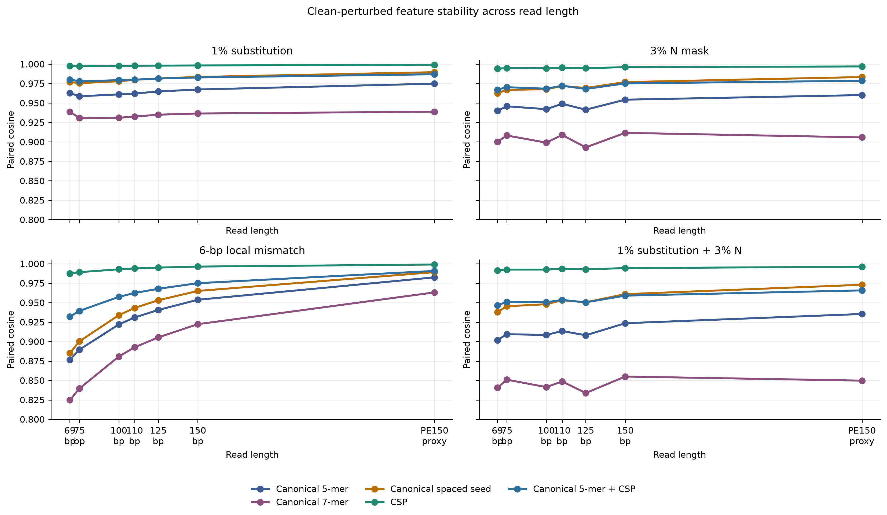
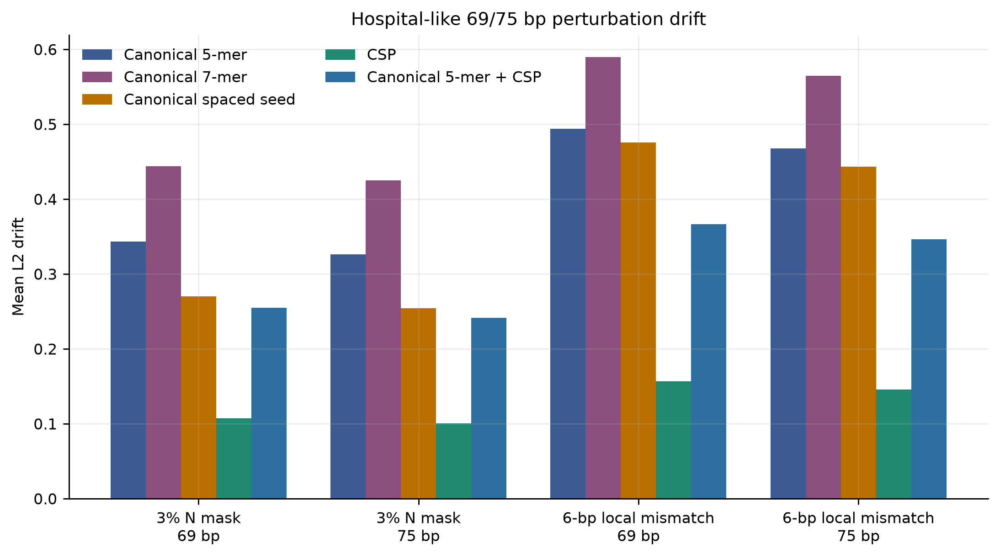
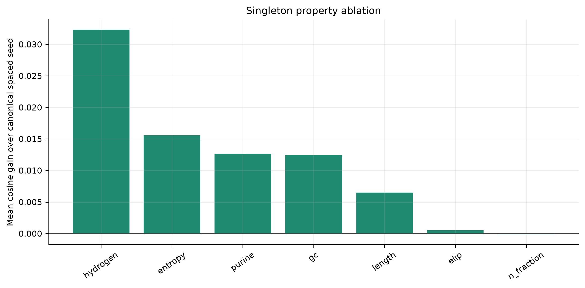
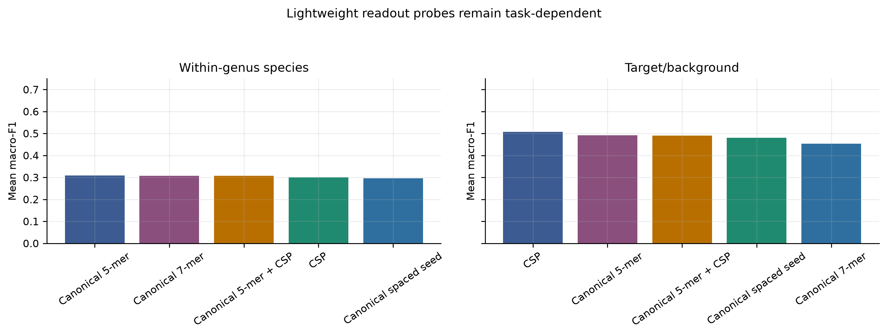
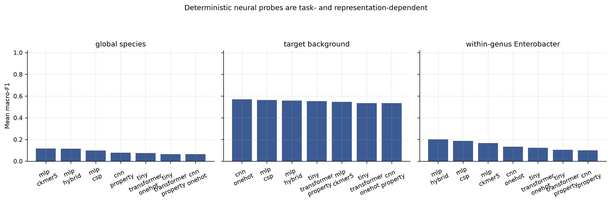
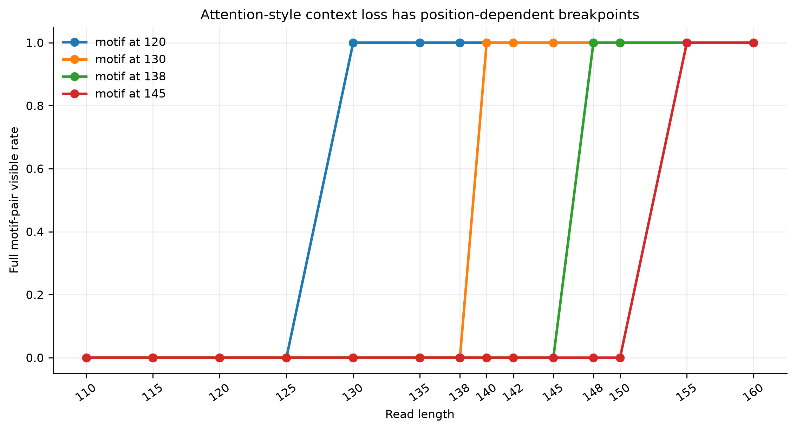
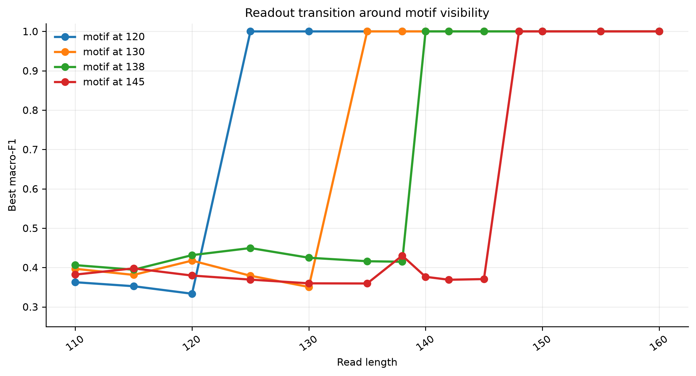
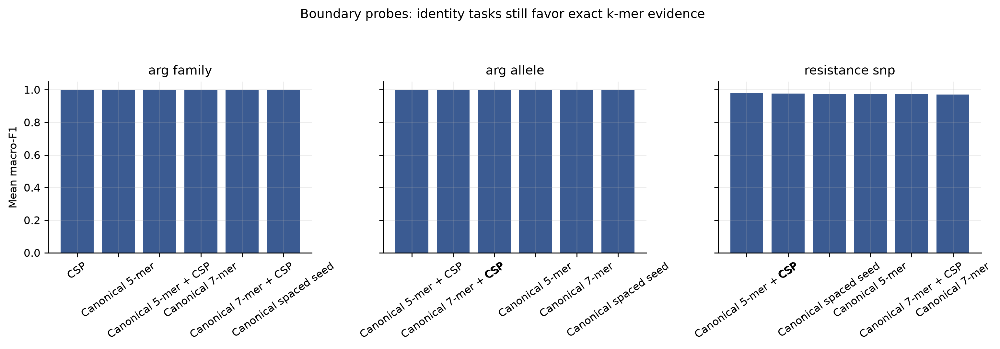

# Controlled information-preservation diagnostics for ultra-short DNA read representations

**Canonical k-mers preserve high-resolution identity evidence, whereas canonical spaced-property encoding provides compact perturbation-stable auxiliary evidence for mNGS-like reads**

## Abstract

Clinical metagenomic next-generation sequencing (mNGS) often produces short or quality-trimmed reads, yet DNA representations are still commonly judged by downstream accuracy alone. This can obscure which information an encoding preserves before any classifier is trained. We present a controlled representation-diagnostics framework for ultra-short DNA reads and define canonical spaced-property encoding (CSP), a deterministic feature block that combines reverse-complement canonical spaced-seed counts with interpretable biochemical summaries. Across a close-relative WGS-slice grid spanning 69, 75, 100, 110, 125, 150 bp and a PE150 proxy, CSP was the top clean-perturbed stability representation in 42 of 42 length-by-perturbation settings. At 69 bp, CSP achieved mean paired cosine of 0.994 under 3% N masking and 0.988 under a 6-bp local mismatch, compared with 0.940 and 0.877 for canonical 5-mers. This advantage did not translate into universal species or resistance accuracy: canonical k-mers remained strong high-resolution identity baselines in close-relative and ARG/SNP probes. A dense context-visibility diagnostic further showed that apparent read-length thresholds depend on motif position, with motif-pair visibility emerging at 130, 140, 148 or 155 bp under different placements. Deterministic neural probes further showed that small CNN and tiny Transformer readouts were task-dependent rather than universally superior. These results support a bounded conclusion: short-read DNA pipelines should separate exact identity evidence from compact perturbation-stable auxiliary evidence, rather than ranking representations by a single accuracy number.

## Introduction

Clinical mNGS has become an important route for pathogen detection because it can detect unexpected organisms without a fixed target panel (Wilson et al., 2014; Wilson et al., 2019; Chiu and Miller, 2019). The same clinical setting also creates difficult input conditions for computational analysis. Reads may be shortened by adapter and quality trimming, contain ambiguous bases, appear from either strand, or include background and low-biomass artifacts (Martin, 2011; Bolger et al., 2014; Salter et al., 2014). These constraints make the representation layer more than an engineering detail. Before a classifier, aligner or database index can succeed, the encoding has already decided which sequence properties remain available.

Most mature metagenomic classifiers are built around exact or near-exact word evidence. Kraken, Kraken 2, CLARK, Centrifuge and Kaiju show the practical power of indexed k-mer, minimizer or translated-word matching at scale (Wood and Salzberg, 2014; Wood et al., 2019; Ounit et al., 2015; Kim et al., 2016; Menzel et al., 2016). CAMI benchmarks further show that apparent performance depends on novelty, taxonomic difficulty, abundance structure and database coverage (Sczyrba et al., 2017; Meyer et al., 2022). These observations argue against using a small local study as a clinical species-identification leaderboard. They also motivate a narrower and testable question: what information does each representation preserve under the short-read perturbations that clinical pipelines actually encounter?

Deep learning has widened the representational vocabulary for DNA. Convolutional and recurrent models have been used to learn regulatory sequence specificity (Alipanahi et al., 2015; Zhou and Troyanskaya, 2015; Quang and Xie, 2016); read-level metagenomic neural classifiers include recurrent and attention-based models (Liang et al., 2020; Wichmann et al., 2023); and DNA foundation models now include k-mer token models, efficient multi-species pretraining, long-context models, reverse-complement-aware architectures and single-nucleotide generative models (Ji et al., 2021; Zhou et al., 2024; Dalla-Torre et al., 2025; Nguyen et al., 2023; Schiff et al., 2024; Fishman et al., 2025; Nguyen et al., 2024). However, a more expressive model cannot attend to information that is absent from the observed read. The short-read setting therefore requires diagnostics that separate model capacity from input information loss.

Here we propose a controlled information-preservation study rather than a final clinical classifier. Our central claim is not that CSP replaces canonical k-mers. Instead, canonical k-mers provide high-resolution identity evidence, whereas CSP provides compact, strand-friendly and perturbation-stable auxiliary evidence. We evaluate this claim using WGS-derived close-relative reads, hospital-like 69/75 bp perturbation grids, CSP component ablation, k and spaced-pattern sensitivity, lightweight readout probes, deterministic neural compatibility probes, synthetic ARG/SNP boundary tasks and attention-style context-visibility diagnostics.

## Related Work

Alignment-free sequence comparison treats word content as a proxy for sequence relatedness. k-mer counting, MinHash sketches and related methods provide efficient representations for genome comparison and metagenomic classification (Marcais and Kingsford, 2011; Ondov et al., 2016; Zielezinski et al., 2017). Canonical k-mers collapse a word and its reverse complement to the same index, which is useful for strand-ambiguous reads but can remove strand-specific signals. Spaced seeds, introduced for sensitive homology search and later applied to metagenomic classification, sample non-contiguous positions within a word and can improve tolerance to mismatches (Ma et al., 2002; Brinda et al., 2015).

DNA can also be represented as a numerical signal. Shannon information theory provides a language for uncertainty and information loss (Shannon, 1948), while chaos game representation, genomic signal processing and EIIP-style mappings show that nucleotide sequences can be converted into compositional or physicochemical channels (Jeffrey, 1990; Voss, 1992; Anastassiou, 2001; Cristea, 2002; Nair and Sreenadhan, 2006). dna2vec similarly bridges discrete k-mers and continuous representations (Ng, 2017). CSP follows this tradition in a deliberately modest way: it adds interpretable biochemical summaries to canonical spaced counts instead of learning a new embedding from large corpora.

Transformer models add the separate issue of token position and co-occurrence. Self-attention can connect all observed tokens (Vaswani et al., 2017), and rotary position embeddings provide a compact relative-position mechanism (Su et al., 2021). But attention cannot recover a motif that is outside the sequenced fragment. We therefore include an attention-context diagnostic that measures visibility of motif relations before attributing read-length effects to a particular neural architecture.

ARG and antimicrobial-resistance analysis imposes stricter biological requirements than coarse taxonomic assignment. Resources and tools such as CARD, AMRFinderPlus, ResFinder and MEGARes/AMR++ encode curated gene families, protein-level evidence, mutation rules and resistome workflows (Alcock et al., 2023; Feldgarden et al., 2021; Bortolaia et al., 2020; Bonin et al., 2023). DeepARG illustrates the use of learned models for ARG prediction (Arango-Argoty et al., 2018). Our experiments do not claim clinical ARG calling. They test whether a compact property-aware block can preserve perturbed ARG-like signal and where exact sequence evidence remains indispensable.

## Terminology and Contribution

We use one term consistently throughout the manuscript. **Canonical k-mer** denotes reverse-complement pooled contiguous k-mer counts. **Canonical spaced seed** denotes reverse-complement pooled counts of non-contiguous tokens. **CSP** denotes canonical spaced-property encoding, implemented in code as `cspaced_property_l2`. **Hybrid** denotes a concatenation of canonical k-mer counts and CSP followed by L2 normalization. **Perturbation stability** denotes similarity between a clean read and a mutated, N-masked, trimmed or locally mismatched version of the same read. It does not mean resistance to multi-species contamination.

The contribution is therefore a representation-diagnostics framework, not a new end-to-end taxonomic classifier. The framework is designed to answer four questions: (i) which features remain stable when a short read is lightly perturbed, (ii) which priors inside CSP contribute to stability, (iii) whether identity-like readout probes favor the same representation, and (iv) when short reads structurally remove context that an attention model would need.

## Method

### Representation definitions

Let a DNA read be \(x = x_1,\ldots,x_L\), with \(x_i \in \{A,C,G,T,N\}\). For a contiguous word \(w=x_i,\ldots,x_{i+k-1}\), ordinary k-mer counting stores \(c_w(x)\). The reverse-complement canonical operation maps a word and its reverse complement to one feature index,

\[
\operatorname{canon}(w)=\min_{\mathrm{lex}}(w,\operatorname{rc}(w)).
\]

For a spaced seed pattern \(P=(p_1,\ldots,p_m)\), the spaced token beginning at position \(i\) is

\[
s_{i,P}(x)=x_{i+p_1}\ldots x_{i+p_m}.
\]

The canonical spaced count vector is \(c_{\operatorname{canon}(s_{i,P})}(x)\). CSP uses the default pattern \(P=(0,2,4,6)\), then concatenates a low-dimensional property vector \(g(x)\). The property vector contains the mean and standard deviation of hydrogen-bond class, GC indicator, purine indicator and EIIP-like base values, plus N fraction, normalized length and Shannon entropy. The final representation is

\[
\phi_{\mathrm{CSP}}(x)=\operatorname{L2}\left([\operatorname{L2}(c_{\operatorname{canon-spaced}}(x)); g(x)]\right).
\]

Thus CSP is not a learned embedding. It is a deterministic auxiliary block that couples strand-canonical spaced evidence with interpretable biochemical summaries.

Canonical 5-mer and 7-mer baselines were included as high-resolution identity features. Canonical spaced seeds were included as a compact mismatch-tolerant baseline. Hybrid features were constructed as L2-normalized concatenations of canonical k-mer counts and CSP. All vocabulary-dependent features were fitted on the training or clean subset defined by each experiment to avoid using perturbed test sequences to define the vocabulary.

### Datasets and perturbations

The main stage-2 WGS panel contained 21 genomes from six close or clinically relevant genera: Acinetobacter, Burkholderia, Candida, Enterobacter, Escherichia and Klebsiella. Reads were generated at 69, 75, 100, 110, 125 and 150 bp, plus a PE150 proxy represented as a 300 bp paired-end-equivalent window. Each length contained 1,680 clean reads before perturbation. Perturbations were generated with fixed random seeds and included 1% substitution, 3% N masking, 5-bp trimming, combined 1% substitution plus 3% N masking, short indels and a 6-bp local mismatch block.

The 69/75 bp analysis was treated as a hospital-like short-read setting because the user-facing project context emphasized 75 bp single-end reads and approximately 69 bp post-QC reads. This experiment measured whether a perturbed read stayed close to its clean counterpart, not whether a clinical sample with multiple organisms was classified correctly.

### Metrics and readout probes

Perturbation stability was measured by paired clean-perturbed cosine similarity, paired L2 drift and nearest-clean retrieval. Compactness was measured by feature dimension and density. Readout probes used nearest centroid, logistic regression and a small scikit-learn MLP with fixed random seeds. These probes measured whether a signal could be extracted by simple models. They were not interpreted as clinical accuracy estimates.

CSP ablation separated canonical spaced counts from property additions: hydrogen-bond class, GC indicator, purine indicator, EIIP-like values, N fraction, entropy and length. Parameter sensitivity swept canonical k-mer values from k=4 to k=9 and several spaced seed patterns. The attention-context diagnostic varied read length densely from 110 to 160 bp and moved a class-defining motif pair across positions 120, 130, 138 and 145. Synthetic ARG/SNP boundary probes tested ARG-family, ARG-allele and resistance-SNP style tasks under the same perturbation logic.

The neural compatibility probe used PyTorch CPU with deterministic seeds and single-thread execution. It compared tabular MLP readouts for canonical 5-mer, CSP and hybrid vectors with 1D-CNN and one-layer tiny Transformer readouts over one-hot or property channels. The probe covered 69, 75, 100 and 150 bp reads, clean/N-masked/combined-perturbation conditions, target/background classification, global species stress classification and an Enterobacter within-genus species task. It was designed to test model-readability, not clinical accuracy.

## Results

### CSP had its clearest advantage in clean-perturbed stability

Across the WGS-slice perturbation grid, CSP was the top representation by paired clean-perturbed cosine in all 42 length-by-perturbation settings. The advantage was largest in short and locally disrupted reads. At 69 bp with a 6-bp local mismatch, CSP reached mean paired cosine of 0.988 and mean L2 drift of 0.157, whereas canonical 5-mer reached 0.877 and 0.494. Under 3% N masking at 69 bp, CSP reached 0.994 paired cosine and 0.107 L2 drift, whereas canonical 5-mer reached 0.940 and 0.344. CSP also had far fewer features than canonical 7-mers, which used roughly 8,000 observed features in the 69/75 bp WGS grid.

| Condition              |   Length | Representation        |   Mean paired cosine |   5th percentile paired cosine |   Mean L2 drift |   95th percentile L2 drift |   Nearest-clean retrieval |   Features |   Density |
|:-----------------------|---------:|:----------------------|---------------------:|-------------------------------:|----------------:|---------------------------:|--------------------------:|-----------:|----------:|
| 1% substitution        |       69 | Canonical 5-mer       |                0.963 |                          0.863 |           0.182 |                      0.523 |                     1     |        512 |     0.112 |
| 1% substitution        |       69 | Canonical 7-mer       |                0.939 |                          0.778 |           0.233 |                      0.667 |                     1     |       8019 |     0.008 |
| 1% substitution        |       69 | Canonical spaced seed |                0.977 |                          0.914 |           0.142 |                      0.415 |                     1     |        136 |     0.351 |
| 1% substitution        |       69 | CSP                   |                0.998 |                          0.991 |           0.047 |                      0.135 |                     1     |        147 |     0.393 |
| 1% substitution        |       69 | Canonical 5-mer + CSP |                0.98  |                          0.927 |           0.133 |                      0.382 |                     1     |        659 |     0.175 |
| 3% N mask              |       69 | Canonical 5-mer       |                0.94  |                          0.921 |           0.344 |                      0.398 |                     1     |        512 |     0.105 |
| 3% N mask              |       69 | Canonical 7-mer       |                0.9   |                          0.882 |           0.444 |                      0.486 |                     1     |       7972 |     0.007 |
| 3% N mask              |       69 | Canonical spaced seed |                0.963 |                          0.945 |           0.27  |                      0.332 |                     1     |        136 |     0.336 |
| 3% N mask              |       69 | CSP                   |                0.994 |                          0.992 |           0.107 |                      0.125 |                     1     |        147 |     0.382 |
| 3% N mask              |       69 | Canonical 5-mer + CSP |                0.967 |                          0.957 |           0.255 |                      0.293 |                     1     |        659 |     0.167 |
| 1% substitution + 3% N |       69 | Canonical 5-mer       |                0.902 |                          0.798 |           0.428 |                      0.635 |                     1     |        512 |     0.105 |
| 1% substitution + 3% N |       69 | Canonical 7-mer       |                0.841 |                          0.688 |           0.548 |                      0.79  |                     1     |       8006 |     0.007 |
| 1% substitution + 3% N |       69 | Canonical spaced seed |                0.938 |                          0.876 |           0.34  |                      0.497 |                     1     |        136 |     0.336 |
| 1% substitution + 3% N |       69 | CSP                   |                0.991 |                          0.985 |           0.128 |                      0.175 |                     1     |        147 |     0.382 |
| 1% substitution + 3% N |       69 | Canonical 5-mer + CSP |                0.947 |                          0.892 |           0.316 |                      0.465 |                     1     |        659 |     0.167 |
| 6-bp local mismatch    |       69 | Canonical 5-mer       |                0.877 |                          0.845 |           0.494 |                      0.557 |                     0.999 |        512 |     0.113 |
| 6-bp local mismatch    |       69 | Canonical 7-mer       |                0.825 |                          0.797 |           0.59  |                      0.637 |                     0.999 |       8104 |     0.008 |
| 6-bp local mismatch    |       69 | Canonical spaced seed |                0.885 |                          0.844 |           0.476 |                      0.558 |                     0.999 |        136 |     0.353 |
| 6-bp local mismatch    |       69 | CSP                   |                0.988 |                          0.983 |           0.157 |                      0.184 |                     0.999 |        147 |     0.394 |
| 6-bp local mismatch    |       69 | Canonical 5-mer + CSP |                0.932 |                          0.915 |           0.367 |                      0.413 |                     0.999 |        659 |     0.176 |

The summary comparison confirmed that this was not a single-condition artifact. CSP exceeded canonical 5-mer, canonical 7-mer, canonical spaced seed and canonical 5-mer+CSP in paired-cosine stability in all matched comparisons.

| Comparison                      |   Mean cosine gain |   Minimum gain |   Maximum gain |   Wins |   Comparisons |
|:--------------------------------|-------------------:|---------------:|---------------:|-------:|--------------:|
| CSP minus Canonical 5-mer       |              0.045 |          0.004 |          0.111 |     42 |            42 |
| CSP minus Canonical 7-mer       |              0.08  |          0.008 |          0.163 |     42 |            42 |
| CSP minus Canonical spaced seed |              0.028 |          0.002 |          0.102 |     42 |            42 |
| CSP minus Canonical 5-mer + CSP |              0.022 |          0.002 |          0.055 |     42 |            42 |

### Ablation showed that the property block, especially hydrogen-bond and entropy summaries, contributed to stability

CSP's stability advantage was not attributable to one isolated scalar. The full property block improved stability over canonical spaced seed counts across the tested short-read perturbations. In singleton ablations, hydrogen-bond class had the largest mean cosine gain over canonical spaced seeds, followed by entropy, purine and GC summaries. N fraction alone added little in this setup, which is expected because N masking also changes the count space.

| component   |   Mean_cosine_gain |   Mean_L2_change |   Max_cosine_gain |   Min_L2_change |
|:------------|-------------------:|-----------------:|------------------:|----------------:|
| hydrogen    |              0.032 |           -0.148 |             0.098 |          -0.3   |
| entropy     |              0.016 |           -0.056 |             0.046 |          -0.109 |
| purine      |              0.013 |           -0.044 |             0.038 |          -0.086 |
| gc          |              0.012 |           -0.043 |             0.037 |          -0.086 |
| length      |              0.006 |           -0.024 |             0.014 |          -0.055 |
| eiip        |              0.001 |           -0.002 |             0.002 |          -0.003 |
| n_fraction  |             -0     |            0     |             0     |          -0     |

| Condition              |   Length |   Cosine gain over spaced seed |   L2 change over spaced seed |   Mean paired cosine |   Mean L2 drift |   Features |
|:-----------------------|---------:|-------------------------------:|-----------------------------:|---------------------:|----------------:|-----------:|
| 3% N mask              |       69 |                          0.032 |                       -0.163 |                0.994 |           0.108 |        147 |
| 1% substitution + 3% N |       69 |                          0.053 |                       -0.212 |                0.992 |           0.127 |        147 |
| 6-bp local mismatch    |       69 |                          0.101 |                       -0.317 |                0.988 |           0.156 |        147 |
| 3% N mask              |       75 |                          0.027 |                       -0.152 |                0.995 |           0.1   |        147 |
| 1% substitution + 3% N |       75 |                          0.047 |                       -0.198 |                0.993 |           0.119 |        147 |
| 6-bp local mismatch    |       75 |                          0.089 |                       -0.297 |                0.989 |           0.146 |        147 |
| 3% N mask              |      150 |                          0.019 |                       -0.126 |                0.996 |           0.087 |        147 |
| 1% substitution + 3% N |      150 |                          0.033 |                       -0.169 |                0.995 |           0.103 |        147 |
| 6-bp local mismatch    |      150 |                          0.031 |                       -0.178 |                0.996 |           0.085 |        147 |

### Lightweight readout probes separated robustness from identity resolution

Readout probes did not reproduce the stability ranking as a universal accuracy ranking. In the within-genus species probe, canonical 5-mer had the highest mean macro-F1 among the tested stage-2 representations, followed closely by canonical 7-mer and the canonical 5-mer+CSP hybrid. CSP was lower. In the target/background probe, CSP had the highest mean macro-F1 but the absolute scores remained modest. This distinction is central: CSP preserved perturbed information well, but exact k-mer evidence remained important for fine identity resolution.

| Task                 | Representation        |   Mean_macro_F1 |   Mean_accuracy |   Mean_features |
|:---------------------|:----------------------|----------------:|----------------:|----------------:|
| Target/background    | CSP                   |           0.507 |           0.553 |         146.99  |
| Target/background    | Canonical 5-mer       |           0.491 |           0.552 |         505.68  |
| Target/background    | Canonical 5-mer + CSP |           0.49  |           0.542 |         652.67  |
| Target/background    | Canonical spaced seed |           0.481 |           0.549 |         135.99  |
| Target/background    | Canonical 7-mer       |           0.453 |           0.574 |        4395.8   |
| Within-genus species | Canonical 5-mer       |           0.309 |           0.329 |         507.783 |
| Within-genus species | Canonical 7-mer       |           0.307 |           0.331 |        4946.21  |
| Within-genus species | Canonical 5-mer + CSP |           0.307 |           0.326 |         654.758 |
| Within-genus species | CSP                   |           0.301 |           0.319 |         146.975 |
| Within-genus species | Canonical spaced seed |           0.297 |           0.316 |         135.975 |

### k and spaced-pattern sensitivity argued against a single-parameter recommendation

The parameter grid showed that the best readout configuration changed with task and read length. Target/background at 69 bp favored a canonical spaced pattern, target/background at 75 bp favored k=5, and within-genus species at 150 bp favored canonical k=6. This supports the paper's framing as a representation-diagnostics study rather than a universal prescription for one k or one seed pattern.

| Probe                |   Length | Method                      | Parameter       |   Mean macro-F1 |   SD macro-F1 |   Mean features |
|:---------------------|---------:|:----------------------------|:----------------|----------------:|--------------:|----------------:|
| target_background    |       69 | canonical spaced            | pattern=0-2-5-7 |           0.555 |         0.085 |          136    |
| target_background    |       75 | k-mer                       | k=5             |           0.543 |         0.11  |          983.8  |
| target_background    |      150 | canonical k-mer             | k=6             |           0.582 |         0.075 |         1957.2  |
| within_genus_species |       69 | canonical spaced + property | pattern=0-3-5-8 |           0.351 |         0.124 |          147    |
| within_genus_species |       75 | k-mer                       | k=5             |           0.373 |         0.135 |          979.5  |
| within_genus_species |      150 | canonical k-mer             | k=6             |           0.398 |         0.181 |         1971.33 |

### Deterministic neural probes showed model compatibility, not neural superiority

The additional PyTorch probe trained 252 small neural readouts with fixed seeds. It did not support a broad claim that CNNs or tiny Transformers automatically improve ultra-short read interpretation. In target/background probes, 1D-CNN over one-hot channels had the highest mean macro-F1, while CSP read by a tabular MLP was close and used only 147 features on average. In global species and within-genus Enterobacter stress probes, the best small models were tabular MLPs over canonical or hybrid vectors, and absolute macro-F1 values remained low. This supports a practical model-matching interpretation: CSP is a natural compact tabular auxiliary input, whereas one-hot or property channels are more appropriate when a CNN or attention model is explicitly trained.

| Task                      | Model                     | Model family     | Input               |   Mean macro-F1 |   Mean accuracy |   Mean features |   Runs |
|:--------------------------|:--------------------------|:-----------------|:--------------------|----------------:|----------------:|----------------:|-------:|
| global species            | mlp ckmer5                | tabular mlp      | ckmer5 count l2     |           0.116 |           0.133 |           512   |     12 |
| global species            | mlp hybrid                | tabular mlp      | hybrid ckmer5 csp   |           0.115 |           0.129 |           659   |     12 |
| global species            | mlp csp                   | tabular mlp      | cspaced property l2 |           0.099 |           0.117 |           147   |     12 |
| global species            | cnn property              | cnn1d            | property            |           0.078 |           0.118 |           492.5 |     12 |
| global species            | tiny transformer onehot   | tiny transformer | onehot              |           0.074 |           0.129 |           492.5 |     12 |
| global species            | tiny transformer property | tiny transformer | property            |           0.065 |           0.128 |           492.5 |     12 |
| global species            | cnn onehot                | cnn1d            | onehot              |           0.065 |           0.103 |           492.5 |     12 |
| target background         | cnn onehot                | cnn1d            | onehot              |           0.569 |           0.583 |           492.5 |     12 |
| target background         | mlp csp                   | tabular mlp      | cspaced property l2 |           0.563 |           0.568 |           147   |     12 |
| target background         | mlp hybrid                | tabular mlp      | hybrid ckmer5 csp   |           0.559 |           0.563 |           659   |     12 |
| target background         | tiny transformer property | tiny transformer | property            |           0.553 |           0.556 |           492.5 |     12 |
| target background         | mlp ckmer5                | tabular mlp      | ckmer5 count l2     |           0.547 |           0.56  |           512   |     12 |
| target background         | tiny transformer onehot   | tiny transformer | onehot              |           0.535 |           0.537 |           492.5 |     12 |
| target background         | cnn property              | cnn1d            | property            |           0.535 |           0.558 |           492.5 |     12 |
| within-genus Enterobacter | mlp hybrid                | tabular mlp      | hybrid ckmer5 csp   |           0.202 |           0.22  |           657   |     12 |
| within-genus Enterobacter | mlp csp                   | tabular mlp      | cspaced property l2 |           0.187 |           0.22  |           147   |     12 |
| within-genus Enterobacter | mlp ckmer5                | tabular mlp      | ckmer5 count l2     |           0.167 |           0.19  |           510   |     12 |
| within-genus Enterobacter | cnn onehot                | cnn1d            | onehot              |           0.133 |           0.209 |           492.5 |     12 |
| within-genus Enterobacter | tiny transformer onehot   | tiny transformer | onehot              |           0.123 |           0.206 |           492.5 |     12 |
| within-genus Enterobacter | tiny transformer property | tiny transformer | property            |           0.105 |           0.187 |           492.5 |     12 |
| within-genus Enterobacter | cnn property              | cnn1d            | property            |           0.1   |           0.189 |           492.5 |     12 |

### Context loss around 125-150 bp was position-dependent, not a single read-length threshold

The attention-context diagnostic directly addressed the concern that a coarse 125 versus 150 bp comparison could misidentify a threshold. The first length with full motif-pair visibility shifted with motif placement: 130 bp when the motif pair began near position 120, 140 bp near position 130, 148 bp near position 138 and 155 bp near position 145. Thus the loss of context is not simply proportional to the number of missing bases. If a biologically or semantically relevant motif relation lies outside the read, self-attention can still connect observed tokens but cannot model the missing relation.

|   Motif position |   First length with full motif-pair visibility |   Maximum pair visibility |                                          Lengths tested |
|-----------------:|-----------------------------------------------:|--------------------------:|--------------------------------------------------------:|
|              120 |                                            130 |                         1 | 110,115,120,125,130,135,138,140,142,145,148,150,155,160 |
|              130 |                                            140 |                         1 | 110,115,120,125,130,135,138,140,142,145,148,150,155,160 |
|              138 |                                            148 |                         1 | 110,115,120,125,130,135,138,140,142,145,148,150,155,160 |
|              145 |                                            155 |                         1 | 110,115,120,125,130,135,138,140,142,145,148,150,155,160 |

### ARG/SNP boundary probes bounded the role of CSP

Synthetic ARG/SNP probes showed why CSP should be treated as auxiliary evidence. CSP was again frequently the top stability representation, but the readout tasks were too easy for many representations in ARG-family and ARG-allele settings. The resistance-SNP probe showed closer differences among methods. These results do not establish clinical ARG or SNP calling. They support a weaker but useful interpretation: CSP can preserve perturbed ARG-like feature proximity, while exact k-mer, alignment or curated database evidence remains necessary for allele-level and SNP-level decisions.

| Boundary task   | Condition           |   Length | Representation   |   Mean paired cosine |   Mean L2 drift |   Nearest-clean retrieval |   Features |
|:----------------|:--------------------|---------:|:-----------------|---------------------:|----------------:|--------------------------:|-----------:|
| arg_allele      | 3% N mask           |       69 | CSP              |                0.994 |           0.105 |                     0.125 |         78 |
| arg_allele      | 3% N mask           |       75 | CSP              |                0.995 |           0.1   |                     0.114 |         81 |
| arg_allele      | 6-bp local mismatch |       69 | CSP              |                0.99  |           0.139 |                     0.119 |         78 |
| arg_allele      | 6-bp local mismatch |       75 | CSP              |                0.991 |           0.131 |                     0.119 |         81 |
| arg_family      | 3% N mask           |       69 | CSP              |                0.994 |           0.105 |                     0.108 |        101 |
| arg_family      | 3% N mask           |       75 | CSP              |                0.995 |           0.099 |                     0.122 |        107 |
| arg_family      | 6-bp local mismatch |       69 | CSP              |                0.989 |           0.145 |                     0.094 |        101 |
| arg_family      | 6-bp local mismatch |       75 | CSP              |                0.99  |           0.137 |                     0.106 |        107 |
| resistance_snp  | 3% N mask           |       69 | CSP              |                0.995 |           0.099 |                     0.042 |         56 |
| resistance_snp  | 3% N mask           |       75 | CSP              |                0.996 |           0.092 |                     0.028 |         57 |
| resistance_snp  | 6-bp local mismatch |       69 | CSP              |                0.993 |           0.121 |                     0.025 |         56 |
| resistance_snp  | 6-bp local mismatch |       75 | CSP              |                0.994 |           0.111 |                     0.031 |         57 |

| task           | Representation        |   Mean_macro_F1 |   Mean_accuracy |   Mean_features |
|:---------------|:----------------------|----------------:|----------------:|----------------:|
| arg_allele     | Canonical 5-mer + CSP |           1     |           1     |         407.417 |
| arg_allele     | Canonical 7-mer + CSP |           1     |           1     |        1160.88  |
| arg_allele     | CSP                   |           0.999 |           0.999 |         117.875 |
| arg_allele     | Canonical 5-mer       |           0.999 |           0.999 |         289.542 |
| arg_allele     | Canonical 7-mer       |           0.999 |           0.999 |        1043     |
| arg_allele     | Canonical spaced seed |           0.999 |           0.999 |         106.875 |
| arg_family     | CSP                   |           1     |           1     |         131     |
| arg_family     | Canonical 5-mer       |           1     |           1     |         346.292 |
| arg_family     | Canonical 5-mer + CSP |           1     |           1     |         477.292 |
| arg_family     | Canonical 7-mer       |           1     |           1     |        1264.5   |
| arg_family     | Canonical 7-mer + CSP |           1     |           1     |        1395.5   |
| arg_family     | Canonical spaced seed |           1     |           1     |         120     |
| resistance_snp | Canonical 5-mer + CSP |           0.979 |           0.982 |         329.25  |
| resistance_snp | CSP                   |           0.976 |           0.979 |          97.583 |
| resistance_snp | Canonical spaced seed |           0.975 |           0.978 |          86.583 |
| resistance_snp | Canonical 5-mer       |           0.975 |           0.978 |         231.667 |
| resistance_snp | Canonical 7-mer + CSP |           0.973 |           0.977 |         875.667 |
| resistance_snp | Canonical 7-mer       |           0.971 |           0.975 |         778.083 |

## Discussion

The main result is a division of labor among representations. Canonical k-mers are still the most defensible backbone for exact identity evidence, especially when the task is close species, strain, allele or SNP resolution. CSP contributes a different property: it keeps perturbed short reads close to their clean counterparts in a compact and interpretable space. In practical terms, this means CSP is better framed as an auxiliary robustness block, a QC/audit feature or a dense side channel for downstream models, not as a replacement for canonical k-mer indices.

This distinction also resolves the apparent conflict around accuracy. Accuracy and macro-F1 are useful only as readout probes in this paper. They ask whether a simple model can extract a signal from the representation. They do not estimate clinical sensitivity, specificity or diagnostic accuracy. Overemphasizing accuracy would be misleading because the panel is intentionally controlled and small. Underemphasizing all readout probes would also be incomplete because a representation that preserves information but cannot be read by any downstream model would have limited practical value.

The most realistic future route is hybrid evidence. For mNGS species identification, canonical k-mers, alignment or database indices should provide high-resolution taxonomic evidence, whereas CSP can track whether short, N-masked or locally mismatched reads remain compositionally and biochemically near the expected clean signal. For ARG work, CSP may help characterize degraded or ambiguous reads and expose interpretable shifts, but allele calling, resistance SNP interpretation, gene context and plasmid linkage require exact sequence, protein-domain or curated database evidence.

Several conclusions remain deliberately unproven. The neural probe was intentionally small and local; it does not establish CNN or Transformer superiority on realistic clinical mNGS data. We did not benchmark Kraken2, Centrifuge, Kaiju or alignment pipelines on the same noisy FASTQ inputs. We did not use real CARD, ResFinder or AMRFinderPlus marker panels for ARG calling. These are appropriate server-stage experiments. The local experiments establish the representation-level evidence needed to justify those larger tests.

## Limitations

The WGS panel contained 21 genomes from six genera and was not designed to represent microbial diversity, hospital background mixtures, abundance variation, host depletion, real quality-score distributions or wet-lab contamination. The perturbations model substitutions, N masking, trimming, short indels and local mismatches, but not full sequencer error profiles or library preparation artifacts. The readout models were intentionally small and deterministic. The ARG/SNP tasks were synthetic boundary probes. Therefore, CSP-alone species identification, ARG allele calling, resistance SNP classification, mobile-element context and plasmid linkage should not be claimed from these data.

## Code and Data Availability

All code, generated lightweight reads, result tables, figures and manuscript builders are maintained in the project repository. Random seeds are fixed in the stage-2 scripts, and the earlier manuscript/results snapshot was preserved as an internal project archive before the stage-2 rerun. A public release should include the executable scripts, configuration files, generated summary tables and exact commit hash used for the submitted manuscript.

## Conclusions

No single DNA representation dominated all short-read mNGS-like settings. Canonical k-mers remained the strongest general-purpose identity evidence. CSP provided a compact, strand-friendly and perturbation-stable auxiliary representation, with its strongest evidence in 69/75 bp N masking, local mismatch and combined perturbation settings. The paper's actionable message is therefore architectural rather than competitive: short-read pipelines should layer exact identity evidence with auxiliary stability evidence, and should evaluate read length through explicit context-visibility diagnostics when attention-like models are considered.

## References

1. Wilson, Michael R.; Naccache, Samia N.; Samayoa, Erika; Biagtan, Mark; Bashir, Ali; Yu, Guixia; Salamat, S. M.; Somasekar, Sneha; et al. (2014). Actionable Diagnosis of Neuroleptospirosis by Next-Generation Sequencing. New England Journal of Medicine. 370. 2408--2417. https://doi.org/10.1056/NEJMoa1401268

2. Wilson, Michael R.; Sample, Heather A.; Zorn, Kaitlyn C.; Arevalo, Samuel; Yu, Guixia; Neuhaus, John; Federman, Scot; Stryke, Deborah; et al. (2019). Clinical Metagenomic Sequencing for Diagnosis of Meningitis and Encephalitis. New England Journal of Medicine. 380. 2327--2340. https://doi.org/10.1056/NEJMoa1803396

3. Chiu, Charles Y.; Miller, Steven A. (2019). Clinical Metagenomics. Nature Reviews Genetics. 20. 341--355. https://doi.org/10.1038/s41576-019-0113-7

4. Martin, Marcel (2011). Cutadapt Removes Adapter Sequences from High-throughput Sequencing Reads. EMBnet.journal. 17. 10--12. https://doi.org/10.14806/ej.17.1.200

5. Bolger, Anthony M.; Lohse, Marc; Usadel, Bjoern (2014). Trimmomatic: A Flexible Trimmer for Illumina Sequence Data. Bioinformatics. 30. 2114--2120. https://doi.org/10.1093/bioinformatics/btu170

6. Salter, Susannah J.; Cox, Michael J.; Turek, Elina M.; Calus, Szymon T.; Cookson, William O.; Moffatt, Miriam F.; Turner, Paul; Parkhill, Julian; et al. (2014). Reagent and Laboratory Contamination Can Critically Impact Sequence-based Microbiome Analyses. BMC Biology. 12. 87. https://doi.org/10.1186/s12915-014-0087-z

7. Wood, Derrick E.; Salzberg, Steven L. (2014). Kraken: Ultrafast Metagenomic Sequence Classification Using Exact Alignments. Genome Biology. 15. R46. https://doi.org/10.1186/gb-2014-15-3-r46

8. Wood, Derrick E.; Lu, Jennifer; Langmead, Ben (2019). Improved Metagenomic Analysis with Kraken 2. Genome Biology. 20. 257. https://doi.org/10.1186/s13059-019-1891-0

9. Ounit, Rachid; Wanamaker, Steve; Close, Timothy J.; Lonardi, Stefano (2015). CLARK: Fast and Accurate Classification of Metagenomic and Genomic Sequences Using Discriminative k-mers. BMC Genomics. 16. 236. https://doi.org/10.1186/s12864-015-1419-2

10. Kim, Daehwan; Song, Li; Breitwieser, Florian P.; Salzberg, Steven L. (2016). Centrifuge: Rapid and Sensitive Classification of Metagenomic Sequences. Genome Research. 26. 1721--1729. https://doi.org/10.1101/gr.210641.116

11. Menzel, Peter; Ng, Kim Lee; Krogh, Anders (2016). Fast and Sensitive Taxonomic Classification for Metagenomics with Kaiju. Nature Communications. 7. 11257. https://doi.org/10.1038/ncomms11257

12. Sczyrba, Alexander; Hofmann, Peter; Belmann, Peter; Koslicki, David; Janssen, Stefan; Droege, Johannes; Gregor, Ivan; Majda, Stephan; et al. (2017). Critical Assessment of Metagenome Interpretation - a Benchmark of Metagenomics Software. Nature Methods. 14. 1063--1071. https://doi.org/10.1038/nmeth.4458

13. Meyer, Fernando; Fritz, Adrian; Deng, Zhi-Luo; Koslicki, David; Gurevich, Alexey; Robertson, Gary; Alser, Mohammed; Antipov, Dmitry; et al. (2022). Critical Assessment of Metagenome Interpretation: the Second Round of Challenges. Nature Methods. 19. 429--440. https://doi.org/10.1038/s41592-022-01431-4

14. Alipanahi, Babak; Delong, Andrew; Weirauch, Matthew T.; Frey, Brendan J. (2015). Predicting the Sequence Specificities of DNA- and RNA-binding Proteins by Deep Learning. Nature Biotechnology. 33. 831--838. https://doi.org/10.1038/nbt.3300

15. Zhou, Jian; Troyanskaya, Olga G. (2015). Predicting Effects of Noncoding Variants with Deep Learning-based Sequence Model. Nature Methods. 12. 931--934. https://doi.org/10.1038/nmeth.3547

16. Quang, Daniel; Xie, Xiaohui (2016). DanQ: A Hybrid Convolutional and Recurrent Deep Neural Network for Quantifying the Function of DNA Sequences. Nucleic Acids Research. 44. e107. https://doi.org/10.1093/nar/gkw226

17. Liang, Qiaoxing; Bible, Paul W.; Liu, Youping; Zou, Bin; Wei, Li (2020). DeepMicrobes: Taxonomic Classification for Metagenomics with Deep Learning. NAR Genomics and Bioinformatics. 2. lqaa009. https://doi.org/10.1093/nargab/lqaa009

18. Wichmann, Felix; Zamudio, Jose R.; Eils, Roland; Schlesner, Matthias (2023). MetaTransformer: Deep Metagenomic Sequencing Read Classification Using Self-attention Models. NAR Genomics and Bioinformatics. 5. lqad082. https://doi.org/10.1093/nargab/lqad082

19. Ji, Yanrong; Zhou, Zhihan; Liu, Han; Davuluri, Ramana V. (2021). DNABERT: Pre-trained Bidirectional Encoder Representations from Transformers Model for DNA-language in Genome. Bioinformatics. 37. 2112--2120. https://doi.org/10.1093/bioinformatics/btab083

20. Zhou, Zhihan; Ji, Yanrong; Li, Weijian; Dutta, Pratik; Davuluri, Ramana V.; Liu, Han (2024). DNABERT-2: Efficient Foundation Model and Benchmark for Multi-Species Genome. https://doi.org/10.48550/arXiv.2306.15006

21. Dalla-Torre, Hugo; Gonzalez, Liam; Mendoza-Revilla, Javier; Carranza, Nicolas Lopez; Grzywaczewski, Adam H.; Oteri, Francesco; Dallago, Christian; Trop, Evan; et al. (2025). Nucleotide Transformer: Building and Evaluating Robust Foundation Models for Human Genomics. Nature Methods. 22. 287--297. https://doi.org/10.1038/s41592-024-02523-z

22. Nguyen, Eric; Poli, Michael; Faizi, Marjan; Thomas, Armin W.; Birch-Sykes, Camden; Wornow, Michael; Patel, Aman; Rabideau, Charles; et al. (2023). HyenaDNA: Long-Range Genomic Sequence Modeling at Single Nucleotide Resolution. arXiv:2306.15794

23. Schiff, Yair; Kao, Chia-Hsiang; Gokaslan, Aaron; Dao, Tri; Gu, Albert; Kuleshov, Volodymyr (2024). Caduceus: Bi-Directional Equivariant Long-Range DNA Sequence Modeling. https://doi.org/10.48550/arXiv.2403.03234

24. Fishman, Veniamin; Kuratov, Yuri; Shmelev, Aleksei; Petrov, Maxim; Penzar, Dmitry; Shepelin, Denis; Chekanov, Nikolay; Kardymon, Olga; et al. (2025). GENA-LM: A Family of Open-source Foundational DNA Language Models for Long Sequences. Nucleic Acids Research. 53. gkae1310. https://doi.org/10.1093/nar/gkae1310

25. Nguyen, Eric; Poli, Michael; Durrant, Matthew G.; Kang, Brian; Katrekar, Dhruva; Li, David B.; Bartie, Liam J.; Thomas, Armin W.; et al. (2024). Sequence Modeling and Design from Molecular to Genome Scale with Evo. Science. 386. eado9336. https://doi.org/10.1126/science.ado9336

26. Marcais, Guillaume; Kingsford, Carl (2011). A Fast, Lock-Free Approach for Efficient Parallel Counting of Occurrences of k-mers. Bioinformatics. 27. 764--770. https://doi.org/10.1093/bioinformatics/btr011

27. Ondov, Brian D.; Treangen, Todd J.; Melsted, Pall; Mallonee, Adam B.; Bergman, Nicholas H.; Koren, Sergey; Phillippy, Adam M. (2016). Mash: Fast Genome and Metagenome Distance Estimation Using MinHash. Genome Biology. 17. 132. https://doi.org/10.1186/s13059-016-0997-x

28. Zielezinski, Andrzej; Vinga, Susana; Almeida, Jonas; Karlowski, Wojciech M. (2017). Alignment-free Sequence Comparison: Benefits, Applications, and Tools. Genome Biology. 18. 186. https://doi.org/10.1186/s13059-017-1319-7

29. Ma, Bin; Tromp, John; Li, Ming (2002). PatternHunter: Faster and More Sensitive Homology Search. Bioinformatics. 18. 440--445. https://doi.org/10.1093/bioinformatics/18.3.440

30. Brinda, Karel; Sykulski, Michal; Kucherov, Gregory (2015). Spaced Seeds Improve k-mer-based Metagenomic Classification. Bioinformatics. 31. 3584--3592. https://doi.org/10.1093/bioinformatics/btv419

31. Shannon, Claude E. (1948). A Mathematical Theory of Communication. Bell System Technical Journal. 27. 379--423, 623--656. https://doi.org/10.1002/j.1538-7305.1948.tb01338.x

32. Jeffrey, H. Joel (1990). Chaos Game Representation of Gene Structure. Nucleic Acids Research. 18. 2163--2170. https://doi.org/10.1093/nar/18.8.2163

33. Voss, Richard F. (1992). Evolution of Long-range Fractal Correlations and 1/f Noise in DNA Base Sequences. Physical Review Letters. 68. 3805--3808. https://doi.org/10.1103/PhysRevLett.68.3805

34. Anastassiou, Dimitris (2001). Genomic Signal Processing. IEEE Signal Processing Magazine. 18. 8--20. https://doi.org/10.1109/79.939833

35. Cristea, Paul D. (2002). Conversion of Nucleotides Sequences into Genomic Signals. Journal of Cellular and Molecular Medicine. 6. 279--303. https://doi.org/10.1111/j.1582-4934.2002.tb00196.x

36. Nair, Achuthsankar S.; Sreenadhan, Sivarama Pillai (2006). A Coding Measure Scheme Employing Electron-Ion Interaction Pseudopotential. Bioinformation. 1. 197--202.

37. Ng, Patrick (2017). dna2vec: Consistent Vector Representations of Variable-length k-mers. arXiv:1701.06279

38. Vaswani, Ashish; Shazeer, Noam; Parmar, Niki; Uszkoreit, Jakob; Jones, Llion; Gomez, Aidan N.; Kaiser, Lukasz; Polosukhin, Illia (2017). Attention Is All You Need. Advances in Neural Information Processing Systems. 30. arXiv:1706.03762

39. Su, Jianlin; Lu, Yu; Pan, Shengfeng; Wen, Bo; Liu, Yunfeng (2021). RoFormer: Enhanced Transformer with Rotary Position Embedding. arXiv:2104.09864

40. Alcock, Brian P.; Huynh, William; Chalil, Romeo; Smith, Keaton W.; Raphenya, Amogelang R.; Wlodarski, Mateusz A.; McArthur, Andrew G. (2023). CARD 2023: Expanded Curation, Support for Machine Learning, and Resistome Prediction at the Comprehensive Antibiotic Resistance Database. Nucleic Acids Research. 51. D690--D699. https://doi.org/10.1093/nar/gkac920

41. Feldgarden, Michael; Brover, Vyacheslav; Gonzalez-Escalona, Narjol; Frye, Jonathan G.; Haendiges, Julie; Haft, Daniel H.; Hoffmann, Maria; Pettengill, James B.; et al. (2021). AMRFinderPlus and the Reference Gene Catalog Facilitate Examination of the Genomic Links among Antimicrobial Resistance, Stress Response, and Virulence. Scientific Reports. 11. 12728. https://doi.org/10.1038/s41598-021-91456-0

42. Bortolaia, Valeria; Kaas, Rolf S.; Ruppe, Etienne; Roberts, Marilyn C.; Schwarz, Stefan; Cattoir, Vincent; Philippon, Arnaud; Allesoe, Rosa Lundbye; et al. (2020). ResFinder 4.0 for Predictions of Phenotypes from Genotypes. Journal of Antimicrobial Chemotherapy. 75. 3491--3500. https://doi.org/10.1093/jac/dkaa345

43. Bonin, Nathalie; Doster, Enrique; Worley, Hannah; Pinnell, Lee J.; Bravo, Jonathan E.; Ferm, Peter; Marini, Simone; Prosperi, Mattia; et al. (2023). MEGARes and AMR++, v3.0: An Updated Comprehensive Database of Antimicrobial Resistance Determinants and an Improved Software Pipeline for Classification Using High-throughput Sequencing. Nucleic Acids Research. 51. D744--D752. https://doi.org/10.1093/nar/gkac1047

44. Arango-Argoty, Gustavo; Garner, Elizabeth; Pruden, Amy; Heath, Lenwood S.; Vikesland, Peter; Zhang, Liqing (2018). DeepARG: A Deep Learning Approach for Predicting Antibiotic Resistance Genes from Metagenomic Data. Microbiome. 6. 23. https://doi.org/10.1186/s40168-018-0401-z
