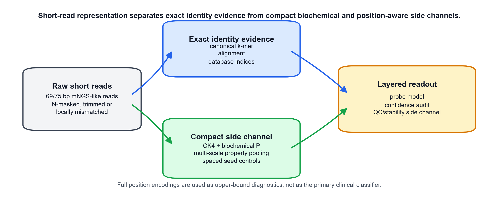

# Compact biochemical and position-aware priors for ultra-short DNA read representation

**Canonical k-mer identity features, compact biochemical summaries and lightweight positional pooling provide complementary evidence for short-read representation diagnostics**

Author: MEI Ruixiang

## Abstract

Clinical metagenomic next-generation sequencing often produces short, trimmed or ambiguous reads, but representation choices are still commonly judged by downstream accuracy alone. This can obscure which information is preserved before any classifier is trained. We present a controlled representation-diagnostics framework for ultra-short DNA reads and test three complementary feature families: reverse-complement canonical k-mer identity features, compact biochemical property summaries and lightweight position-aware property pooling. Across WGS-derived perturbation grids, ART Illumina-like simulator profiles and CAMI_TOY_low readout probes, canonical k-mers remained the appropriate identity backbone, whereas biochemical property side channels improved perturbation stability. The most balanced compact representation was canonical 4-mer plus multi-scale property means: it had the highest ART stability among compact CK4/CK5 variants and retained only about 222 features. Controlled motif-position tasks and full-matrix screens showed that fine positional information is accessible when the representation exposes it, but complete position matrices were higher-dimensional and task-specific. A direct full-matrix P-versus-non-P ablation showed that property channels improved ART stability over position one-hot (delta paired cosine 0.044, 95% analysis-cell CI 0.030 to 0.058; delta L2 drift -0.190, -0.228 to -0.152) and gave a small CAMI target/background readout gain (delta macro-F1 0.048, 0.006 to 0.085), while not universally improving controlled motif readout. Spaced-seed CSP was retained as a mechanism and sensitivity control rather than the central method. These results support an architectural conclusion rather than a classifier leaderboard: short-read pipelines should layer exact identity evidence with compact biochemical and position-aware auxiliary evidence, and should treat full positional encodings as upper-bound diagnostics unless larger validation justifies their cost.

## Introduction

Clinical mNGS has become an important route for pathogen detection because it can detect unexpected organisms without a fixed target panel (Wilson et al., 2014; Wilson et al., 2019; Chiu and Miller, 2019). The same setting creates difficult input conditions for computational analysis. Reads may be shortened by adapter and quality trimming, contain ambiguous bases, appear from either strand, or include background and low-biomass artifacts (Martin, 2011; Bolger et al., 2014; Salter et al., 2014). These constraints make representation design more than an engineering detail. Before a classifier, aligner or database index can succeed, the encoding has already decided which sequence properties remain available.

Most mature metagenomic classifiers are built around exact or near-exact word evidence. Kraken, Kraken 2, CLARK, Centrifuge and Kaiju show the practical power of indexed k-mer, minimizer or translated-word matching at scale (Wood and Salzberg, 2014; Wood et al., 2019; Ounit et al., 2015; Kim et al., 2016; Menzel et al., 2016). CAMI benchmarks further show that apparent performance depends on novelty, taxonomic difficulty, abundance structure and database coverage (Sczyrba et al., 2017; Meyer et al., 2022). These observations argue against presenting a small local study as a clinical species-identification leaderboard. They motivate a narrower question: what information does each representation preserve under short-read perturbations, and what is the cost of making that information readable?

This manuscript separates three representational roles. Canonical k-mers provide high-resolution identity evidence. Biochemical property summaries provide compact, interpretable and perturbation-stable side information. Position-aware property pooling attempts to recover limited layout information without flattening a full per-position matrix. Full position encodings, including property channels and RoPE-like variants, are used only as upper-bound diagnostics for what fine positional information can expose.

The resulting claim is deliberately bounded. We do not propose a final clinical taxonomic or resistance classifier. We test whether compact biochemical and position-aware priors can complement canonical k-mer evidence in short-read representation diagnostics. The evidence combines WGS-derived clean-perturbed read pairs, ART Illumina-like simulator profiles, CAMI_TOY_low lightweight readout probes, controlled motif-position tasks and spaced-seed mechanism checks. Accuracy and macro-F1 are interpreted only as downstream readout probes, not as clinical endpoints.

## Related Work

Alignment-free sequence comparison treats word content as a proxy for sequence relatedness. k-mer counting, MinHash sketches and related methods provide efficient representations for genome comparison and metagenomic classification (Marcais and Kingsford, 2011; Ondov et al., 2016; Zielezinski et al., 2017). Canonical k-mers collapse a word and its reverse complement to the same index, which is useful for strand-ambiguous reads but can remove strand-specific signals. Spaced seeds, introduced for sensitive homology search and later applied to metagenomic classification, sample non-contiguous positions within a word and can improve tolerance to mismatches (Ma et al., 2002; Brinda et al., 2015).

DNA can also be represented as a numerical signal. Shannon information theory provides a language for uncertainty and information loss (Shannon, 1948), while chaos game representation, genomic signal processing and EIIP-style mappings show that nucleotide sequences can be converted into compositional or physicochemical channels (Jeffrey, 1990; Voss, 1992; Anastassiou, 2001; Cristea, 2002; Nair and Sreenadhan, 2006). dna2vec similarly bridges discrete k-mers and continuous representations (Ng, 2017). CSP follows this tradition in a deliberately modest way: it adds interpretable biochemical summaries to canonical spaced counts instead of learning a new embedding from large corpora.

Transformer models add the separate issue of token position and co-occurrence. Self-attention can connect all observed tokens (Vaswani et al., 2017), and rotary position embeddings provide a compact relative-position mechanism (Su et al., 2021). But attention cannot recover a motif that is outside the sequenced fragment. We therefore include an attention-context diagnostic that measures visibility of motif relations before attributing read-length effects to a particular neural architecture.

ARG and antimicrobial-resistance analysis imposes stricter biological requirements than coarse taxonomic assignment. Resources and tools such as CARD, AMRFinderPlus, ResFinder and MEGARes/AMR++ encode curated gene families, protein-level evidence, mutation rules and resistome workflows (Alcock et al., 2023; Feldgarden et al., 2021; Bortolaia et al., 2020; Bonin et al., 2023). DeepARG illustrates the use of learned models for ARG prediction (Arango-Argoty et al., 2018). Our experiments do not claim clinical ARG calling. They test whether a compact property-aware block can preserve perturbed ARG-like signal and where exact sequence evidence remains indispensable.

## Terminology and Contribution

We use one term for one representation family. **CK4** and **CK5** denote reverse-complement canonical contiguous 4-mer and 5-mer count vectors. **P** denotes the biochemical property side channel, including hydrogen-bond class, GC, purine, EIIP-like values, N fraction, entropy and length summaries. **CK4+P** denotes canonical 4-mer counts concatenated with a global property summary. **Multi-scale property pooling** denotes property means or means plus standard deviations computed over 2, 3, 4 and 6 read bins. **Soft positional moments** denote property centers, spread, skew and terminal enrichment. **Anchor-adaptive pooling** denotes exploratory summaries around local high-information anchors. **CSP** denotes the older canonical spaced-property control, implemented as `cspaced_property_l2`; it is retained as a spaced-seed mechanism control, not as the primary method.

The contribution is a representation-diagnostics framework for ultra-short reads. It answers five questions: (i) how much stability a compact biochemical property block adds to canonical k-mer counts, (ii) whether multi-scale positional pooling improves compact side-channel information, (iii) when full position matrices reveal information that compact descriptors cannot, (iv) whether spaced-seed effects are universal or mechanism-specific, and (v) how read length limits context visibility independently of model architecture.

### Representation map and layered evidence architecture

The study treats representation design as a division of labor rather than a one-winner leaderboard. Table 1 summarizes the representation families, their expected strengths and their failure modes.

| representation | encoded information | strength | failure mode | suitable downstream model | suitable task |
|:--|:--|:--|:--|:--|:--|
| canonical k-mer (`CK4/CK5`) | Reverse-complement canonical contiguous k-mer counts. | Strong exact identity evidence and close-relative baseline. | Sparse and sensitive to local sequencing errors as k grows. | Nearest-centroid/logistic probes and database-index-like methods. | Identity support, close-relative readout and taxonomic/ARG backbone evidence. |
| `CK4+P` global property | Canonical 4-mer counts plus GC, purine, hydrogen-bond, EIIP, N-fraction, entropy and length summaries. | Compact biochemical prior with better perturbation stability than count-only CK4. | Global summaries discard local layout and motif position. | Shallow readout probes and compact side-channel models. | Robustness/QC side evidence for short or noisy reads. |
| `CK4+P` multi-scale property | CK4 plus property summaries pooled over 2, 3, 4 and 6 read bins. | Adds coarse layout information with modest dimension cost; strongest compact stability balance in current runs. | Cannot match full position resolution for precise motif localization. | Logistic/centroid probes; side-channel feature block. | Main compact position-aware biochemical representation. |
| soft positional moments | CK4 plus property centers, spread, skew and terminal enrichment. | Very low-dimensional soft position summary. | Limited resolution for local motifs and complex rearrangements. | Shallow probes and sensitivity analysis. | Ablation for whether a small amount of position information is enough. |
| anchor-adaptive property pooling | CK4 plus property summaries around local high-information anchors. | Tests event-centered local context. | Anchor definition is exploratory and may be unstable. | Exploratory shallow probes. | Supplementary/future-work dynamic position summary. |
| CSP / spaced-property control | Reverse-complement canonical spaced counts plus global property summary. | Useful historical/matching-inspired control and stable auxiliary feature. | Spaced positions are mechanism-specific and not a universal dense-feature advantage. | Shallow probes and seed-mechanism diagnostics. | Boundary control for spaced-seed effects. |
| full position property channels | Per-position biochemical channels, with optional RoPE/property variants. | High-resolution position-readable upper bound; property channels improve ART stability over one-hot. | Higher dimension and task-specific readout gains; not the primary method. | Diagnostic shallow readouts or future sequence encoders. | Upper-bound diagnostic for fine position information. |
| one-hot / RoPE one-hot controls | Per-position base identity with or without RoPE-like phase. | Isolates position resolution without biochemical semantics. | Higher dimensional than compact summaries and can be less stable under ART-like perturbation. | Diagnostic readout probes. | Non-property full-matrix control for the value of P. |

Figure 1 summarizes the operational interpretation used throughout the manuscript: raw short reads feed exact identity evidence and compact biochemical/position-aware side-channel evidence before any lightweight readout or stability audit. Full position matrices serve as upper-bound diagnostics rather than the default representation.

## Method

### Rationale for controlled simulated reads

The data design follows the level of the claim. Because this manuscript tests representation-level information preservation rather than end-to-end clinical classification, the primary experiments require read-level ground truth and paired clean-versus-perturbed fragments. WGS-derived reads provide controlled species origin, read length and perturbation axes. ART Illumina validation tested whether the same stability patterns held under a field-standard sequencing-error profile rather than only under hand-specified substitutions, N masking and trimming. CAMI low-complexity data were used as an external benchmark probe for lightweight readout, not as a production taxonomic-classification leaderboard.

### Representation definitions

Let a DNA read be \(x=x_1,\ldots,x_L\), with \(x_i \in \{A,C,G,T,N\}\). For a contiguous word \(w=x_i,\ldots,x_{i+k-1}\), reverse-complement canonicalization maps \(w\) and \(\operatorname{rc}(w)\) to the same feature index,

\[
\operatorname{canon}(w)=\min_{\mathrm{lex}}(w,\operatorname{rc}(w)).
\]

CK4 and CK5 are L2-normalized canonical k-mer count vectors. The global biochemical property vector \(g(x)\) contains summary statistics of hydrogen-bond class, GC indicator, purine indicator and EIIP-like base values, together with N fraction, normalized length and Shannon entropy. The compact CK4+P representation is

\[
\phi_{\mathrm{CK4+P}}(x)=\operatorname{L2}([\operatorname{L2}(c_{\operatorname{canon-4mer}}(x));g(x)]).
\]

For multi-scale property pooling, the read is partitioned into \(b\in\{2,3,4,6\}\) bins. For each bin, biochemical property means, and optionally standard deviations, are computed and concatenated. The primary compact position-aware representation in the revised manuscript is CK4 plus multi-scale property means. Soft positional moments instead summarize where property mass lies along the read by center, variance, skew and terminal enrichment. Anchor-adaptive pooling is exploratory: it chooses local high-information anchors, such as entropy or rare-k-mer peaks, and summarizes left, right and local property neighborhoods.

CSP uses a spaced seed pattern \(P=(0,2,4,6)\) and is retained as a control for the spaced-seed idea rather than as the manuscript's core method. The spaced token beginning at position \(i\) is \(s_{i,P}(x)=x_{i+p_1}\ldots x_{i+p_m}\), and CSP concatenates reverse-complement canonical spaced counts with the global property vector. The final seed-layout sanity checks therefore support only a conservative default and a mechanism boundary, not a universal optimized spaced seed.

Full position encodings include one-hot, property channels, RoPE-one-hot, RoPE-property, base-property matrices and k-mer property sequences. They are flattened for shallow diagnostic probes. These encodings test whether fine layout information is readable and whether biochemical semantics improve over non-property positional controls, but they are not treated as the main compact method.

### Data sources and perturbations

The main stage-2 WGS panel contained 21 genomes from six close or clinically relevant genera: Acinetobacter, Burkholderia, Candida, Enterobacter, Escherichia and Klebsiella. Reads were generated at 69, 75, 100, 110, 125 and 150 bp, plus a PE150 proxy represented as a 300 bp paired-end-equivalent window. Each length contained 1,680 clean reads before perturbation. Perturbations were generated with fixed random seeds and included 1% substitution, 3% N masking, 5-bp trimming, combined 1% substitution plus 3% N masking, short indels and a 6-bp local mismatch block.

The 69/75 bp analysis was treated as a hospital-like short-read setting because the user-facing project context emphasized 75 bp single-end reads and approximately 69 bp post-QC reads. This experiment measured whether a perturbed read stayed close to its clean counterpart, not whether a clinical sample with multiple organisms was classified correctly.

Stage-3 validation extended this data hierarchy without changing the paper's scope. ART Illumina profiles generated platform-like sequencing-error reads from the same reference genomes, preserving paired stability metrics while replacing hand-specified perturbations with a commonly used read simulator. CAMI_TOY_low reads were processed as an external benchmark subset for target/background and multi-taxon lightweight readout probes. These additions tested externality and noise-model robustness, not clinical sensitivity or specificity.

### Metrics and readout probes

Perturbation stability was measured by paired clean-perturbed cosine similarity, paired L2 drift and nearest-clean retrieval. Compactness was measured by feature dimension and density. Readout probes were shallow diagnostics, primarily nearest centroid and logistic regression. Existing CAMI grids also retained a fixed scikit-learn MLP readout where it had already been generated, but this was treated only as an information-accessibility probe rather than as a neural baseline family. These probes measured whether a signal could be extracted by simple models. They were not interpreted as clinical accuracy estimates.

Ablations separated count-only CK4/CK5 features, global biochemical properties, multi-scale property pooling, soft positional moments, anchor-adaptive pooling, spaced-property CSP and full position encodings. Bootstrap intervals are analysis-cell intervals over length, condition, perturbation or classifier cells. They quantify robustness across the controlled analysis grid and should not be read as clinical sample-level uncertainty.

## Results

### Biochemical property summaries and multi-scale pooling stabilized compact canonical k-mer features

The revised compact screen compared count-only canonical k-mers, global CK4+P, multi-scale property pooling, soft moments, CSP and CK5 variants. Across the WGS-derived perturbation grid, CK4+P already improved stability over CK4 count, and adding multi-scale property means gave the best compact stability balance: mean paired cosine 0.991, mean L2 drift 0.116 and about 222 features. CSP remained stable but no longer led the compact screen, supporting its role as a spaced-seed control rather than the primary method.

| representation_label        |   paired_cosine |   l2_drift |   retrieval |   mean_features |
|:----------------------------|----------------:|-----------:|------------:|----------------:|
| CK4 count                   |           0.935 |      0.316 |       0.999 |             136 |
| CK4+P global                |           0.99  |      0.122 |       0.999 |             147 |
| CK4+P multi-scale mean      |           0.991 |      0.116 |       0.999 |             222 |
| CK4+P multi-scale           |           0.99  |      0.119 |       0.999 |             297 |
| CK4+P moments               |           0.989 |      0.125 |       0.999 |             187 |
| CSP/spaced-property control |           0.989 |      0.129 |       0.999 |             147 |
| CK5 count                   |           0.882 |      0.433 |       1     |             512 |
| CK5+P multi-scale           |           0.985 |      0.15  |       1     |             673 |

ART Illumina-like simulation reinforced the same hierarchy. CK4+P multi-scale mean gave the highest compact ART stability, followed closely by multi-scale standard-deviation and moment variants. Count-only CK4 and CK5 were substantially less stable, while CSP was close to global CK4+P but did not exceed the multi-scale compact variants.

| representation_label        |   paired_cosine |   l2_drift |   retrieval |   mean_features |
|:----------------------------|----------------:|-----------:|------------:|----------------:|
| CK4 count                   |           0.943 |      0.255 |       0.998 |           137.6 |
| CK4+P global                |           0.994 |      0.085 |       1     |           148.6 |
| CK4+P multi-scale mean      |           0.994 |      0.081 |       1     |           223.6 |
| CK4+P multi-scale           |           0.994 |      0.081 |       1     |           298.6 |
| CK4+P moments               |           0.994 |      0.082 |       1     |           188.6 |
| CSP/spaced-property control |           0.994 |      0.087 |       0.999 |           148.6 |
| CK5 count                   |           0.9   |      0.341 |       0.998 |           514   |
| CK5+P multi-scale           |           0.99  |      0.108 |       1     |           675   |

### Readout probes showed task-dependent gains rather than a universal accuracy winner

Readout probes were used only to ask whether the information in a representation was accessible to shallow models. In the WGS-derived target/background probe, CK4+P multi-scale mean had the highest average macro-F1 among the compact variants, whereas within-genus species discrimination remained k-mer-dominated and all compact variants differed only modestly. This supports a representation-level claim, not a species-classifier claim.

WGS target/background readout:

| representation_label        |   macro_f1 |   accuracy |   mean_features |   n_cells |
|:----------------------------|-----------:|-----------:|----------------:|----------:|
| CK4+P multi-scale mean      |      0.512 |      0.558 |         221.35  |       160 |
| CK4+P moments               |      0.506 |      0.553 |         186.35  |       160 |
| CK4+P multi-scale           |      0.505 |      0.551 |         296.35  |       160 |
| CSP/spaced-property control |      0.501 |      0.55  |         146.762 |       160 |
| CK5+P multi-scale           |      0.496 |      0.57  |         652.95  |       160 |
| CK4+P global                |      0.494 |      0.541 |         146.35  |       160 |
| CK4 count                   |      0.492 |      0.537 |         135.8   |       160 |
| CK5 count                   |      0.48  |      0.564 |         500.875 |       160 |

WGS within-genus species readout:

| representation_label        |   macro_f1 |   accuracy |   mean_features |   n_cells |
|:----------------------------|-----------:|-----------:|----------------:|----------:|
| CK5+P multi-scale           |      0.303 |      0.32  |         659.688 |       192 |
| CSP/spaced-property control |      0.299 |      0.316 |         146.917 |       192 |
| CK5 count                   |      0.298 |      0.314 |         503.521 |       192 |
| CK4+P multi-scale mean      |      0.297 |      0.313 |         221.688 |       192 |
| CK4+P multi-scale           |      0.292 |      0.309 |         296.688 |       192 |
| CK4+P global                |      0.29  |      0.306 |         146.688 |       192 |
| CK4+P moments               |      0.29  |      0.306 |         186.688 |       192 |
| CK4 count                   |      0.289 |      0.303 |         135.833 |       192 |

The CAMI_TOY_low compact readout probe gave the same caution. CK4+P multi-scale variants were strong in target/background readout, but the label-level probe favored simpler CK4+P global or moment variants and absolute multi-taxon scores remained low. CAMI therefore supports external readability of compact biochemical features, not clinical taxonomic performance.

CAMI target/background readout:

| representation_label        |   macro_f1 |   accuracy |   mean_features |   n_cells |
|:----------------------------|-----------:|-----------:|----------------:|----------:|
| CK4+P multi-scale           |      0.766 |      0.768 |         297     |        27 |
| CK5+P multi-scale           |      0.759 |      0.768 |         672.333 |        27 |
| CK4+P multi-scale mean      |      0.753 |      0.755 |         222     |        27 |
| CK4 count                   |      0.745 |      0.748 |         136     |        27 |
| CK4+P global                |      0.734 |      0.736 |         147     |        27 |
| CK4+P moments               |      0.726 |      0.728 |         187     |        27 |
| CK5 count                   |      0.716 |      0.732 |         511.778 |        27 |
| CSP/spaced-property control |      0.7   |      0.708 |         147     |        27 |

CAMI label-probe readout:

| representation_label        |   macro_f1 |   accuracy |   mean_features |   n_cells |
|:----------------------------|-----------:|-----------:|----------------:|----------:|
| CK4+P global                |      0.253 |      0.267 |             147 |        27 |
| CK4+P moments               |      0.251 |      0.266 |             187 |        27 |
| CK4+P multi-scale           |      0.251 |      0.265 |             297 |        27 |
| CK4 count                   |      0.248 |      0.262 |             136 |        27 |
| CK4+P multi-scale mean      |      0.245 |      0.259 |             222 |        27 |
| CK5+P multi-scale           |      0.244 |      0.255 |             673 |        27 |
| CK5 count                   |      0.237 |      0.248 |             512 |        27 |
| CSP/spaced-property control |      0.142 |      0.154 |             147 |        27 |

### Full-matrix controls separated position resolution from biochemical semantics

Full position encodings were retained as high-resolution diagnostics. In controlled motif-position readout, full position encodings exposed layout information that compact descriptors only partly recovered. However, the P-versus-non-P comparison showed that biochemical semantics were not a universal readout advantage in these controlled tasks: one-hot and RoPE-one-hot were competitive or stronger for some motif-position settings. This is an important boundary, because it prevents us from claiming that biochemical properties automatically dominate exact positional identity.

| task                  | representation_label       |   n_cells | macro-F1 (95% CI)    | accuracy (95% CI)    |   mean_features |
|:----------------------|:---------------------------|----------:|:---------------------|:---------------------|----------------:|
| motif_jitter_position | position k-mer property    |         4 | 0.592 [0.578, 0.610] | 0.596 [0.582, 0.614] |          1288   |
| motif_jitter_position | RoPE one-hot               |         4 | 0.541 [0.518, 0.564] | 0.544 [0.521, 0.567] |          1352   |
| motif_jitter_position | one-hot + property matrix  |         4 | 0.528 [0.487, 0.556] | 0.532 [0.493, 0.560] |           845   |
| motif_jitter_position | position one-hot           |         4 | 0.528 [0.488, 0.568] | 0.533 [0.494, 0.573] |           422.5 |
| motif_jitter_position | RoPE property              |         4 | 0.527 [0.483, 0.567] | 0.532 [0.494, 0.571] |          1352   |
| motif_jitter_position | position property channels |         4 | 0.509 [0.483, 0.535] | 0.514 [0.489, 0.537] |           422.5 |
| motif_jitter_position | CK4+P multi-scale mean     |         4 | 0.399 [0.367, 0.436] | 0.403 [0.367, 0.439] |           222   |
| motif_jitter_position | canonical 5-mer            |         4 | 0.342 [0.321, 0.368] | 0.345 [0.325, 0.370] |           512   |
| same_spectrum_order   | canonical 5-mer            |         4 | 0.992 [0.984, 1.000] | 0.992 [0.984, 1.000] |           201   |
| same_spectrum_order   | RoPE one-hot               |         4 | 0.992 [0.989, 0.994] | 0.992 [0.989, 0.994] |          1352   |
| same_spectrum_order   | RoPE property              |         4 | 0.991 [0.987, 0.994] | 0.991 [0.988, 0.994] |          1352   |
| same_spectrum_order   | position one-hot           |         4 | 0.989 [0.983, 0.994] | 0.989 [0.984, 0.994] |           422.5 |
| same_spectrum_order   | CK4+P multi-scale mean     |         4 | 0.989 [0.977, 1.000] | 0.989 [0.977, 1.000] |           193   |
| same_spectrum_order   | one-hot + property matrix  |         4 | 0.984 [0.978, 0.987] | 0.984 [0.978, 0.988] |           845   |
| same_spectrum_order   | position property channels |         4 | 0.977 [0.962, 0.986] | 0.977 [0.962, 0.986] |           422.5 |
| same_spectrum_order   | position k-mer property    |         4 | 0.969 [0.950, 0.987] | 0.969 [0.950, 0.988] |          1288   |

The same full-matrix comparison was more favorable to biochemical properties under perturbation and external target/background probes. In ART, position property channels improved paired cosine over position one-hot by 0.044 and reduced L2 drift by 0.190; RoPE-property similarly improved over RoPE-one-hot under the same positional transform. In the CAMI target/background smoke probe, property channels gave a small positive macro-F1 delta over one-hot, whereas k-mer property sequences and RoPE-property did not consistently outperform compact k-mer baselines. Full matrices therefore define an upper-bound and mechanism diagnostic, not the paper's main representation.

ART P-versus-non-P deltas:

| contrast                        |   n_paired_cells | delta paired_cosine_mean (95% CI)   | delta l2_delta_mean (95% CI)   | delta retrieval_top1 (95% CI)   | interpretation                                                                  |
|:--------------------------------|-----------------:|:------------------------------------|:-------------------------------|:--------------------------------|:--------------------------------------------------------------------------------|
| property_channels - one_hot     |                2 | 0.044 [0.030, 0.058]                | -0.190 [-0.228, -0.152]        | 0.000 [0.000, 0.000]            | per-position biochemical property channels versus per-position base identity    |
| base_property - one_hot         |                2 | 0.018 [0.012, 0.025]                | -0.061 [-0.074, -0.047]        | 0.000 [0.000, 0.000]            | adding property channels to one-hot positional identity                         |
| rope_property - rope_onehot     |                2 | 0.011 [0.007, 0.015]                | -0.035 [-0.043, -0.027]        | 0.000 [0.000, 0.000]            | property semantics under the same RoPE-like positional transform                |
| kmer_property - ckmer5_count_l2 |                2 | 0.139 [0.107, 0.172]                | -0.327 [-0.372, -0.281]        | 0.000 [0.000, 0.000]            | position-resolved k-mer property sequence versus compact canonical k-mer counts |

CAMI P-versus-non-P deltas:

| contrast                        |   n_paired_cells | delta macro_f1 (95% CI)   | delta accuracy (95% CI)   | interpretation                                                                  |
|:--------------------------------|-----------------:|:--------------------------|:--------------------------|:--------------------------------------------------------------------------------|
| property_channels - one_hot     |                8 | 0.048 [0.006, 0.085]      | 0.049 [0.007, 0.090]      | per-position biochemical property channels versus per-position base identity    |
| base_property - one_hot         |                8 | 0.008 [-0.031, 0.049]     | 0.007 [-0.028, 0.049]     | adding property channels to one-hot positional identity                         |
| rope_property - rope_onehot     |                8 | -0.030 [-0.079, 0.014]    | -0.028 [-0.076, 0.014]    | property semantics under the same RoPE-like positional transform                |
| kmer_property - ckmer5_count_l2 |                8 | -0.085 [-0.134, -0.031]   | -0.090 [-0.146, -0.035]   | position-resolved k-mer property sequence versus compact canonical k-mer counts |

### Spaced-seed, context and ARG/SNP diagnostics defined the boundary of the claim

The spaced-seed analyses no longer serve as the main novelty claim. They show a mechanism boundary: spaced seeds can help seed-hit survival when mutations fall in skipped positions, but they can lose when mutations hit sampled positions. The focused seed-layout scan also showed that `P=(0,2,4,6)` was not a universal optimum; `0-1-2-3` ranked highest in the final four-position stability-only sanity check. We therefore keep CSP as a matching-inspired control and avoid presenting S0246 as the source of the paper's innovation.

The attention-context diagnostic was retained only to interpret read-length limits. When two motif/context elements did not both fall inside the observed read, no representation could recover that relation. Once the read length crossed the visibility threshold, position-resolved representations could read it out. This supports the distinction between lost sequence context and insufficient encoding.

Synthetic ARG/SNP probes were kept as boundary checks. They showed that compact stable representations can remain close to perturbed ARG-like reads, but exact allele, resistance-SNP, functional-site and gene-context decisions require canonical k-mer, alignment, protein-domain or curated database evidence. Stability is therefore not biological equivalence.

## Discussion

The main result is a division of labor among representations. Canonical k-mers remain the most defensible identity backbone. Biochemical properties add compact perturbation-stable side information. Multi-scale property pooling adds a small but useful amount of coarse layout information without flattening a full position matrix. Full position encodings expose more layout information but at substantially higher dimensional cost and with task-specific gains.

This resolves the earlier CSP conflict. Spaced seeds are well motivated as matching and retrieval devices, but their value depends on where mutations fall relative to sampled positions. Used as dense feature summaries, they did not provide a universal advantage over contiguous CK4+P. The manuscript therefore shifts the novelty from S0246 to compact biochemical and position-aware property priors, while retaining CSP as a transparent mechanism control.

The P-versus-non-P full-matrix ablation also sharpens the claim. Property channels were more stable than one-hot under ART-like perturbation and gave a small CAMI target/background readout gain. Yet biochemical semantics did not consistently beat one-hot in controlled motif-position readout. The correct interpretation is not that P is always better than base identity. It is that P supplies a useful perturbation-stable biochemical side channel, while exact identity and fine layout require k-mer or full position evidence.

Accuracy and macro-F1 remain downstream probes in this manuscript. They ask whether a shallow model can read information from a representation. They do not estimate clinical sensitivity, specificity or diagnostic accuracy. The paper's contribution is therefore a representation diagnostic and design principle: layer exact identity evidence with compact biochemical and position-aware auxiliary evidence, and treat read length and context visibility as part of the representation problem.

## Limitations

This study remains a representation-diagnostics study rather than a clinical diagnostic validation. The WGS panel contained 21 genomes from six genera and was designed for controlled mechanism analysis, not for microbial diversity, hospital abundance structure, host depletion, database incompleteness, sample-level uncertainty or wet-lab contamination. ART Illumina-like simulation adds a standard sequencing-error model, but it cannot reproduce all library-preparation artifacts or clinical background mixtures. CAMI_TOY_low provides external read-level truth, but the subset used here supports only lightweight readout probes. Bootstrap intervals are analysis-cell intervals over controlled settings, not population-level clinical uncertainty.

Full-matrix position encodings were tested only in small triage screens. They are sufficient to show that fine position information can be useful and to test P-versus-non-P semantics, but they are not sufficient to promote a high-dimensional full-matrix method as the paper's main contribution. Anchor-adaptive pooling is also exploratory and should remain future work unless anchor stability is tested more directly.

## Future Work

Future work should connect the compact representation layer to end-to-end mNGS pipelines with realistic host/background mixtures, abundance variation, larger genome-held-out panels and independent tools such as Kraken2, Centrifuge and Kaiju. For antimicrobial resistance, curated CARD, ResFinder, AMRFinderPlus and MEGARes/AMR++ tasks should test whether the identity-plus-side-channel architecture helps ARG-family screening without claiming allele or resistance-SNP calls from compact features alone. A larger future position-encoding study could compare full position matrices, learned sequence models and compact property pooling, but that is deliberately outside the present manuscript.

## Conclusions

No single DNA representation dominated all short-read settings. Canonical k-mers preserved identity evidence. Compact biochemical properties improved perturbation stability. Multi-scale property pooling supplied the best current balance between stability, dimension and limited positional information. Full position encodings confirmed that layout information can matter, but their cost and task dependence make them upper-bound diagnostics rather than the default method. The actionable message is architectural: short-read DNA pipelines should layer exact identity evidence with compact biochemical and position-aware auxiliary evidence instead of ranking representations by a single downstream accuracy number.

## Author Information and Submission Metadata

Author: MEI Ruixiang. Full institutional affiliation, corresponding-author designation, email address, ORCID, funding statement and acknowledgements should be finalized with the supervising group before journal submission. The current working template uses the following conservative defaults until institutional details are supplied: competing interests, none declared; ethics approval, not applicable for controlled simulated reads and public benchmark data; author contributions, conception, implementation, analysis and drafting by MEI Ruixiang with supervisory contributions to be specified before submission.

## Code and Data Availability

All code, generated lightweight reads, result tables, figures and manuscript builders are maintained in the project repository (https://github.com/FairYJmrx/ultrashort-dna-representation-diagnostics; current local HEAD should be replaced by the final public archive hash after repository cleanup). The main reproduction path for the revised manuscript is: install `requirements.txt`, then run `scripts/run_stage3_compact_baselines.py`, `scripts/run_stage3_art_validation.py`, `scripts/run_stage3_cami_probe.py`, `scripts/run_position_property_controlled_tasks.py`, `scripts/generate_stage3_bootstrap_ci.py`, `scripts/generate_fullmatrix_property_contribution_ci.py`, `scripts/generate_stage3_manuscript_assets_v2.py` and `scripts/finalize_stage3_manuscript_v5.py`. The submitted release package should include executable scripts, configuration files, lightweight public/toy datasets, WGS-slice manifests, generated summary tables, figures, manuscript builders and final manuscript files. It should exclude virtual environments, historical drafts, render intermediates, full CAMI archives and bulky ART FASTQ/SAM intermediates; those files can be regenerated or re-extracted from the documented manifests and scripts.

## References

1. Wilson, Michael R.; Naccache, Samia N.; Samayoa, Erika; Biagtan, Mark; Bashir, Ali; Yu, Guixia; Salamat, S. M.; Somasekar, Sneha; et al. (2014). Actionable Diagnosis of Neuroleptospirosis by Next-Generation Sequencing. New England Journal of Medicine. 370. 2408--2417. https://doi.org/10.1056/NEJMoa1401268

2. Wilson, Michael R.; Sample, Heather A.; Zorn, Kaitlyn C.; Arevalo, Samuel; Yu, Guixia; Neuhaus, John; Federman, Scot; Stryke, Deborah; et al. (2019). Clinical Metagenomic Sequencing for Diagnosis of Meningitis and Encephalitis. New England Journal of Medicine. 380. 2327--2340. https://doi.org/10.1056/NEJMoa1803396

3. Chiu, Charles Y.; Miller, Steven A. (2019). Clinical Metagenomics. Nature Reviews Genetics. 20. 341--355. https://doi.org/10.1038/s41576-019-0113-7

4. Martin, Marcel (2011). Cutadapt Removes Adapter Sequences from High-throughput Sequencing Reads. EMBnet.journal. 17. 10--12. https://doi.org/10.14806/ej.17.1.200

5. Bolger, Anthony M.; Lohse, Marc; Usadel, Bjoern (2014). Trimmomatic: A Flexible Trimmer for Illumina Sequence Data. Bioinformatics. 30. 2114--2120. https://doi.org/10.1093/bioinformatics/btu170

6. Salter, Susannah J.; Cox, Michael J.; Turek, Elina M.; Calus, Szymon T.; Cookson, William O.; Moffatt, Miriam F.; Turner, Paul; Parkhill, Julian; et al. (2014). Reagent and Laboratory Contamination Can Critically Impact Sequence-based Microbiome Analyses. BMC Biology. 12. 87. https://doi.org/10.1186/s12915-014-0087-z

7. Wood, Derrick E.; Salzberg, Steven L. (2014). Kraken: Ultrafast Metagenomic Sequence Classification Using Exact Alignments. Genome Biology. 15. R46. https://doi.org/10.1186/gb-2014-15-3-r46

8. Wood, Derrick E.; Lu, Jennifer; Langmead, Ben (2019). Improved Metagenomic Analysis with Kraken 2. Genome Biology. 20. 257. https://doi.org/10.1186/s13059-019-1891-0

9. Ounit, Rachid; Wanamaker, Steve; Close, Timothy J.; Lonardi, Stefano (2015). CLARK: Fast and Accurate Classification of Metagenomic and Genomic Sequences Using Discriminative k-mers. BMC Genomics. 16. 236. https://doi.org/10.1186/s12864-015-1419-2

10. Kim, Daehwan; Song, Li; Breitwieser, Florian P.; Salzberg, Steven L. (2016). Centrifuge: Rapid and Sensitive Classification of Metagenomic Sequences. Genome Research. 26. 1721--1729. https://doi.org/10.1101/gr.210641.116

11. Menzel, Peter; Ng, Kim Lee; Krogh, Anders (2016). Fast and Sensitive Taxonomic Classification for Metagenomics with Kaiju. Nature Communications. 7. 11257. https://doi.org/10.1038/ncomms11257

12. Sczyrba, Alexander; Hofmann, Peter; Belmann, Peter; Koslicki, David; Janssen, Stefan; Droege, Johannes; Gregor, Ivan; Majda, Stephan; et al. (2017). Critical Assessment of Metagenome Interpretation - a Benchmark of Metagenomics Software. Nature Methods. 14. 1063--1071. https://doi.org/10.1038/nmeth.4458

13. Meyer, Fernando; Fritz, Adrian; Deng, Zhi-Luo; Koslicki, David; Gurevich, Alexey; Robertson, Gary; Alser, Mohammed; Antipov, Dmitry; et al. (2022). Critical Assessment of Metagenome Interpretation: the Second Round of Challenges. Nature Methods. 19. 429--440. https://doi.org/10.1038/s41592-022-01431-4

14. Huang, Weichun; Li, Leping; Myers, Jason R.; Marth, Gabor T. (2012). ART: A Next-generation Sequencing Read Simulator. Bioinformatics. 28. 593--594. https://doi.org/10.1093/bioinformatics/btr708

15. Alipanahi, Babak; Delong, Andrew; Weirauch, Matthew T.; Frey, Brendan J. (2015). Predicting the Sequence Specificities of DNA- and RNA-binding Proteins by Deep Learning. Nature Biotechnology. 33. 831--838. https://doi.org/10.1038/nbt.3300

16. Zhou, Jian; Troyanskaya, Olga G. (2015). Predicting Effects of Noncoding Variants with Deep Learning-based Sequence Model. Nature Methods. 12. 931--934. https://doi.org/10.1038/nmeth.3547

17. Quang, Daniel; Xie, Xiaohui (2016). DanQ: A Hybrid Convolutional and Recurrent Deep Neural Network for Quantifying the Function of DNA Sequences. Nucleic Acids Research. 44. e107. https://doi.org/10.1093/nar/gkw226

18. Liang, Qiaoxing; Bible, Paul W.; Liu, Youping; Zou, Bin; Wei, Li (2020). DeepMicrobes: Taxonomic Classification for Metagenomics with Deep Learning. NAR Genomics and Bioinformatics. 2. lqaa009. https://doi.org/10.1093/nargab/lqaa009

19. Wichmann, Felix; Zamudio, Jose R.; Eils, Roland; Schlesner, Matthias (2023). MetaTransformer: Deep Metagenomic Sequencing Read Classification Using Self-attention Models. NAR Genomics and Bioinformatics. 5. lqad082. https://doi.org/10.1093/nargab/lqad082

20. Ji, Yanrong; Zhou, Zhihan; Liu, Han; Davuluri, Ramana V. (2021). DNABERT: Pre-trained Bidirectional Encoder Representations from Transformers Model for DNA-language in Genome. Bioinformatics. 37. 2112--2120. https://doi.org/10.1093/bioinformatics/btab083

21. Zhou, Zhihan; Ji, Yanrong; Li, Weijian; Dutta, Pratik; Davuluri, Ramana V.; Liu, Han (2024). DNABERT-2: Efficient Foundation Model and Benchmark for Multi-Species Genome. https://doi.org/10.48550/arXiv.2306.15006

22. Dalla-Torre, Hugo; Gonzalez, Liam; Mendoza-Revilla, Javier; Carranza, Nicolas Lopez; Grzywaczewski, Adam H.; Oteri, Francesco; Dallago, Christian; Trop, Evan; et al. (2025). Nucleotide Transformer: Building and Evaluating Robust Foundation Models for Human Genomics. Nature Methods. 22. 287--297. https://doi.org/10.1038/s41592-024-02523-z

23. Nguyen, Eric; Poli, Michael; Faizi, Marjan; Thomas, Armin W.; Birch-Sykes, Camden; Wornow, Michael; Patel, Aman; Rabideau, Charles; et al. (2023). HyenaDNA: Long-Range Genomic Sequence Modeling at Single Nucleotide Resolution. arXiv:2306.15794

24. Schiff, Yair; Kao, Chia-Hsiang; Gokaslan, Aaron; Dao, Tri; Gu, Albert; Kuleshov, Volodymyr (2024). Caduceus: Bi-Directional Equivariant Long-Range DNA Sequence Modeling. https://doi.org/10.48550/arXiv.2403.03234

25. Fishman, Veniamin; Kuratov, Yuri; Shmelev, Aleksei; Petrov, Maxim; Penzar, Dmitry; Shepelin, Denis; Chekanov, Nikolay; Kardymon, Olga; et al. (2025). GENA-LM: A Family of Open-source Foundational DNA Language Models for Long Sequences. Nucleic Acids Research. 53. gkae1310. https://doi.org/10.1093/nar/gkae1310

26. Nguyen, Eric; Poli, Michael; Durrant, Matthew G.; Kang, Brian; Katrekar, Dhruva; Li, David B.; Bartie, Liam J.; Thomas, Armin W.; et al. (2024). Sequence Modeling and Design from Molecular to Genome Scale with Evo. Science. 386. eado9336. https://doi.org/10.1126/science.ado9336

27. Marcais, Guillaume; Kingsford, Carl (2011). A Fast, Lock-Free Approach for Efficient Parallel Counting of Occurrences of k-mers. Bioinformatics. 27. 764--770. https://doi.org/10.1093/bioinformatics/btr011

28. Ondov, Brian D.; Treangen, Todd J.; Melsted, Pall; Mallonee, Adam B.; Bergman, Nicholas H.; Koren, Sergey; Phillippy, Adam M. (2016). Mash: Fast Genome and Metagenome Distance Estimation Using MinHash. Genome Biology. 17. 132. https://doi.org/10.1186/s13059-016-0997-x

29. Zielezinski, Andrzej; Vinga, Susana; Almeida, Jonas; Karlowski, Wojciech M. (2017). Alignment-free Sequence Comparison: Benefits, Applications, and Tools. Genome Biology. 18. 186. https://doi.org/10.1186/s13059-017-1319-7

30. Ma, Bin; Tromp, John; Li, Ming (2002). PatternHunter: Faster and More Sensitive Homology Search. Bioinformatics. 18. 440--445. https://doi.org/10.1093/bioinformatics/18.3.440

31. Brinda, Karel; Sykulski, Michal; Kucherov, Gregory (2015). Spaced Seeds Improve k-mer-based Metagenomic Classification. Bioinformatics. 31. 3584--3592. https://doi.org/10.1093/bioinformatics/btv419

32. Shannon, Claude E. (1948). A Mathematical Theory of Communication. Bell System Technical Journal. 27. 379--423, 623--656. https://doi.org/10.1002/j.1538-7305.1948.tb01338.x

33. Jeffrey, H. Joel (1990). Chaos Game Representation of Gene Structure. Nucleic Acids Research. 18. 2163--2170. https://doi.org/10.1093/nar/18.8.2163

34. Voss, Richard F. (1992). Evolution of Long-range Fractal Correlations and 1/f Noise in DNA Base Sequences. Physical Review Letters. 68. 3805--3808. https://doi.org/10.1103/PhysRevLett.68.3805

35. Anastassiou, Dimitris (2001). Genomic Signal Processing. IEEE Signal Processing Magazine. 18. 8--20. https://doi.org/10.1109/79.939833

36. Cristea, Paul D. (2002). Conversion of Nucleotides Sequences into Genomic Signals. Journal of Cellular and Molecular Medicine. 6. 279--303. https://doi.org/10.1111/j.1582-4934.2002.tb00196.x

37. Nair, Achuthsankar S.; Sreenadhan, Sivarama Pillai (2006). A Coding Measure Scheme Employing Electron-Ion Interaction Pseudopotential. Bioinformation. 1. 197--202.

38. Ng, Patrick (2017). dna2vec: Consistent Vector Representations of Variable-length k-mers. arXiv:1701.06279

39. Vaswani, Ashish; Shazeer, Noam; Parmar, Niki; Uszkoreit, Jakob; Jones, Llion; Gomez, Aidan N.; Kaiser, Lukasz; Polosukhin, Illia (2017). Attention Is All You Need. Advances in Neural Information Processing Systems. 30. arXiv:1706.03762

40. Su, Jianlin; Lu, Yu; Pan, Shengfeng; Wen, Bo; Liu, Yunfeng (2021). RoFormer: Enhanced Transformer with Rotary Position Embedding. arXiv:2104.09864

41. Alcock, Brian P.; Huynh, William; Chalil, Romeo; Smith, Keaton W.; Raphenya, Amogelang R.; Wlodarski, Mateusz A.; McArthur, Andrew G. (2023). CARD 2023: Expanded Curation, Support for Machine Learning, and Resistome Prediction at the Comprehensive Antibiotic Resistance Database. Nucleic Acids Research. 51. D690--D699. https://doi.org/10.1093/nar/gkac920

42. Feldgarden, Michael; Brover, Vyacheslav; Gonzalez-Escalona, Narjol; Frye, Jonathan G.; Haendiges, Julie; Haft, Daniel H.; Hoffmann, Maria; Pettengill, James B.; et al. (2021). AMRFinderPlus and the Reference Gene Catalog Facilitate Examination of the Genomic Links among Antimicrobial Resistance, Stress Response, and Virulence. Scientific Reports. 11. 12728. https://doi.org/10.1038/s41598-021-91456-0

43. Bortolaia, Valeria; Kaas, Rolf S.; Ruppe, Etienne; Roberts, Marilyn C.; Schwarz, Stefan; Cattoir, Vincent; Philippon, Arnaud; Allesoe, Rosa Lundbye; et al. (2020). ResFinder 4.0 for Predictions of Phenotypes from Genotypes. Journal of Antimicrobial Chemotherapy. 75. 3491--3500. https://doi.org/10.1093/jac/dkaa345

44. Bonin, Nathalie; Doster, Enrique; Worley, Hannah; Pinnell, Lee J.; Bravo, Jonathan E.; Ferm, Peter; Marini, Simone; Prosperi, Mattia; et al. (2023). MEGARes and AMR++, v3.0: An Updated Comprehensive Database of Antimicrobial Resistance Determinants and an Improved Software Pipeline for Classification Using High-throughput Sequencing. Nucleic Acids Research. 51. D744--D752. https://doi.org/10.1093/nar/gkac1047

45. Arango-Argoty, Gustavo; Garner, Elizabeth; Pruden, Amy; Heath, Lenwood S.; Vikesland, Peter; Zhang, Liqing (2018). DeepARG: A Deep Learning Approach for Predicting Antibiotic Resistance Genes from Metagenomic Data. Microbiome. 6. 23. https://doi.org/10.1186/s40168-018-0401-z
